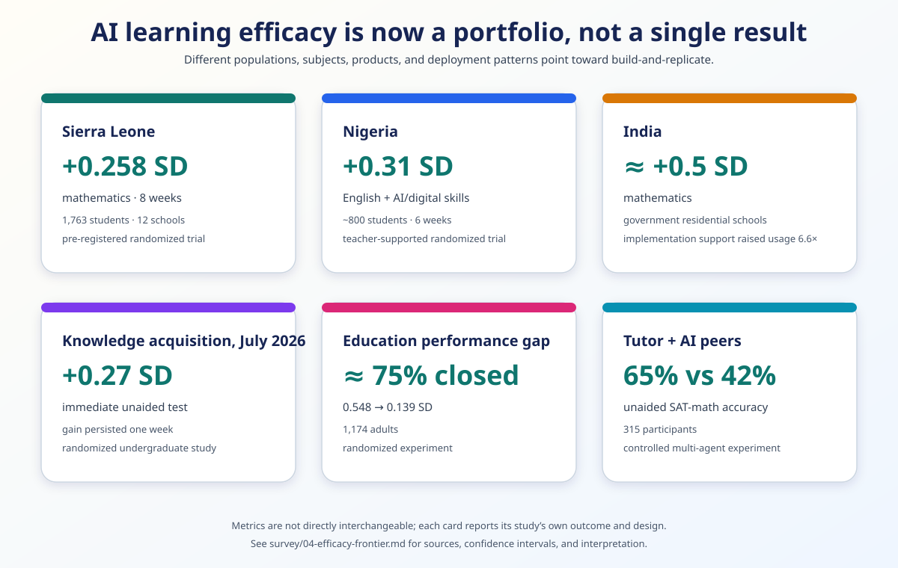

# The Frontier Has Crossed



*The studies use different populations, subjects, durations, and outcome
measures; together they establish a portfolio of positive learning signals.*

The central finding of this survey is optimistic and actionable:

> Frontier AI can already deliver meaningful personalized learning, and the
> combined cost, language, speech, vision, and on-device curves make universal
> expert mentorship a credible near-term goal.

The dominant question is no longer “can an AI tutor work?” It is “how quickly can
we turn current capability into reliable, locally grounded mentorship for every
learner?”

## 1. The outcome evidence is now a portfolio

| Deployment or study | Result | Why it matters |
|---|---:|---|
| Gemini Guided Learning, Sierra Leone | **+0.258 SD mathematics** | Pre-registered RCT; 1,763 students; 12 schools |
| Teacher-supported generative AI, Nigeria | **+0.31 SD** | Six-week randomized field deployment; gains across several outcomes |
| Khan Academy implementation support, India | **nearly +0.5 SD mathematics** | Government residential schools; usage rose 7.2→47.4 min/week |
| Generative AI for learning an unfamiliar topic | **+0.27 SD unaided test** | July 2026 randomized study; gain persisted one week |
| AI and the education performance gap | gap **0.548→0.139 SD** | Randomized N=1,174; roughly three quarters of the measured gap closed |
| LearnLM/Eedi exploratory trial | **+5.5 percentage points** | Better performance on a novel later topic than human tutoring alone |

Sources:

- [Sierra Leone trial](https://deepmind.google/blog/measuring-the-impact-of-learning-with-ai-in-sierra-leone-and-beyond/) `MEASURED-RCT`
- [Nigeria World Bank trial](https://documents.worldbank.org/en/publication/documents-reports/documentdetail/099548105192529324) `MEASURED-RCT`
- [India implementation trial](https://www.nber.org/papers/w34683) `MEASURED-RCT`
- [July 2026 knowledge-acquisition RCT](https://arxiv.org/abs/2607.08849) `MEASURED-RCT`
- [NBER skills-gap experiment](https://www.nber.org/papers/w34851) `MEASURED-RCT`
- [LearnLM/Eedi study](https://arxiv.org/abs/2512.23633) `MEASURED-RCT`, exploratory

These studies differ in population, product, subject, duration, and support.
That diversity is the point. The positive result is no longer confined to one
lab or one product pattern. We now have enough signal to pursue deployment,
replication, and improvement with urgency.

## 2. The capability stack arrived together

The educational effect sizes matter because the surrounding system has also
changed.

### Conversation

GPT-Live provides full-duplex speech; Gemini Live and open audio models expand
the design space for natural interruption, pronunciation, and oral practice.
Voice makes one-to-one instruction available to learners for whom typing or
reading is a barrier.

### Adaptive curricula

Gemini Study Notebooks diagnoses a goal, decomposes it into more than 100
objectives, generates lessons and quizzes, updates a skill dashboard, and links
to source-grounded notebooks. This is evidence that the consumer product unit
is moving from “chat” to **adaptive course**. `VENDOR`

### Dynamic learning objects

ChatGPT can generate interactive visual explanations across mathematics and
science; Claude Opus 5 creates manipulable artifacts such as simulations and
interactive demonstrations; modern image models can render dense diagrams and
small text. The tutor can increasingly create the representation a learner
needs in the moment. `VENDOR`

### Local and multilingual operation

Gemma 4 targets phones and laptops with text, image, and audio; Sarvam Edge is
sub-1GB and targets all 22 scheduled Indian languages; Meta Omnilingual ASR
covers more than 1,600 languages; Mistral OCR 4 covers 170 languages. Universal
delivery no longer means routing every utterance through an English-first
frontier model. `VENDOR` + `MEASURED-BENCH`

### Economics

At published DeepSeek V4 Flash prices, an intentionally generous cached text
session can be modeled at roughly **$0.012 per learner-hour**. At 180 hours per
year that is about **$2.19 per learner-year** before devices, support, and
delivery. This is an illustrative calculation, not a procurement quote, but it
shows why the bottleneck has moved from raw inference to implementation.

See [the reach analysis](../research/raw/F4-reach-economics.md).

## 3. The system design that follows

The universal mentor has six load-bearing components.

1. **A learner-owned longitudinal state.** It remembers goals, prerequisites,
   mastery, language, accessibility needs, interests, and successful teaching
   approaches.
2. **A teaching-mode router.** It can diagnose, explain, model, ask, hint,
   reveal, verify, practice, retrieve, transfer, celebrate, or escalate.
3. **A specialist mesh.** Routine turns stay local or cheap; difficult questions
   route to the best subject, language, verification, or safety agent.
4. **A dynamic learning-object engine.** Any concept can become a story,
   diagram, simulation, worked example, oral drill, or locally meaningful
   analogy.
5. **An offline-first delivery layer.** The lesson continues on shared, modest
   hardware and syncs when connectivity returns.
6. **A teacher-and-family collaboration surface.** AI supplies abundant
   individual attention while people supply goals, care, culture, judgment, and
   accountability.

The architecture is ambitious, but none of its primitives is hypothetical.

## 4. What the research program should optimize

The field should stop treating adoption anxiety as its default research
question. The higher-value program is constructive:

- Which tutoring policies produce the largest gains for learners starting
  furthest behind?
- How much expert mentorship can one teacher orchestrate with an agent mesh?
- Which languages and dialects need community datasets or model adapters next?
- How small can the offline stack become without sacrificing instructional
  quality?
- Which dynamic representations best unlock a given misconception?
- How quickly can the system identify a prerequisite gap and repair it?
- What is the cost per durable learning gain, by geography and learner group?
- How do teachers, families, and learners inspect and correct the learner model?
- Which safety and escalation patterns deserve global open standards?

These questions assume abundance is possible and then make it measurable.

## 5. Evidence without pessimism

An optimistic survey still distinguishes randomized outcomes, benchmark
results, observed deployments, product claims, and author inference. It still
reports uncertainty and scope. But rigor does not require manufacturing a
negative counterpoint for every advance.

The editorial rule is:

> Include a limitation when it changes a decision, an architecture, a safety
> boundary, or the interpretation of a result—not to perform artificial balance.

For example, the Sierra Leone effect has a wide confidence interval and varied
by baseline achievement. That does not erase the result; it defines the next
engineering target: make the gain reliable and largest for learners furthest
behind.

## 6. No child left behind becomes literal

The aim is not a premium tutor for already advantaged students. It is a
world-class mentor available to a child in rural Africa, China, India, Latin
America, an island, a refugee settlement, or an under-resourced neighborhood,
speaking the language that child actually uses.

The technical strategy is:

```
local speech + local curriculum + learner state
        ↓
low-cost everyday mentor
        ↓
frontier specialist when needed
        ↓
teacher, family, and community collaboration
        ↓
measured mastery and expanding opportunity
```

AI makes expert attention abundant. The moral and engineering task is to
distribute that abundance.
