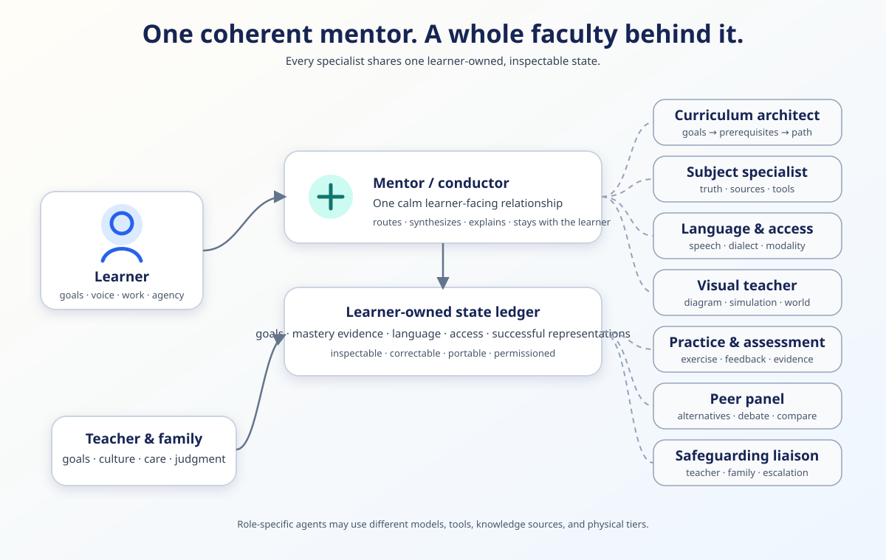
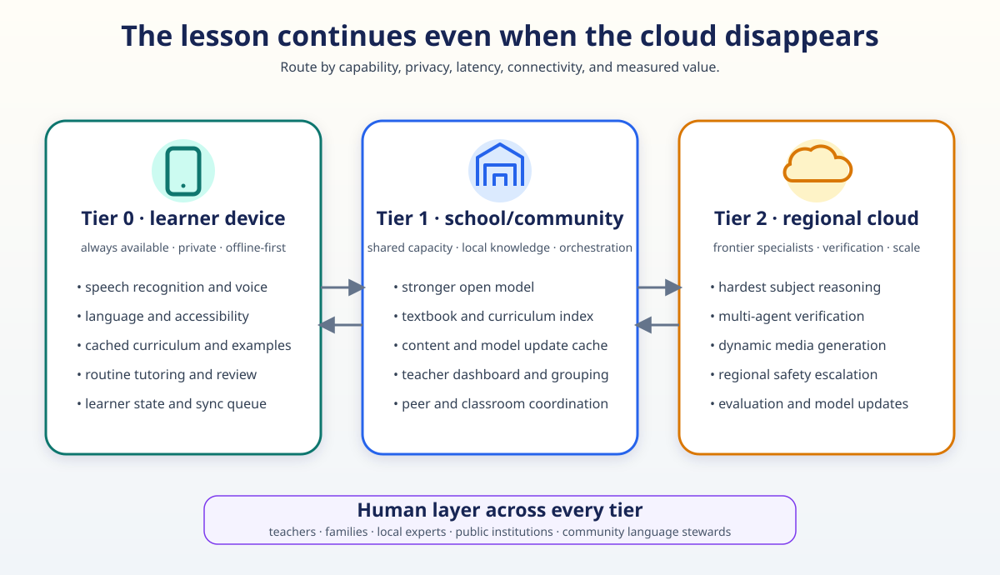

# The Expert Mentor Mesh



*One coherent relationship in front; a role-tested faculty and inspectable
learner-owned memory behind it.*

The universal AI mentor should feel like one relationship and operate like a
whole faculty.

A curriculum architect plans. A subject expert checks truth. A diagnostician
finds the prerequisite gap. A language mentor preserves meaning. A visual
teacher creates the right representation. A practice coach gathers evidence. AI
peers expose alternative reasoning. A safeguarding agent brings in a trusted
person. One conductor turns all of this into a coherent next step.

## The 2026 evidence

A controlled SAT-mathematics study with 315 participants compared no agents, AI
peers, an AI tutor, and tutor plus peers. Unaided test accuracy was
approximately **42%, 48%, 59%, and 65%**. Tutor plus peers produced the largest
gain over control, although its difference from tutor alone was not significant
in the exploratory pairwise analysis. `MEASURED-RCT`

In a second experiment with 247 writers, both single- and two-model assistance
improved essay quality. Only the two-model condition kept idea diversity near
the no-AI baseline. `MEASURED-RCT`

Source: [Beyond the AI Tutor](https://arxiv.org/abs/2604.02677)

The technical stack now matches the research direction:

- [GPT-5.6 multi-agent orchestration](https://developers.openai.com/api/docs/guides/latest-model) can coordinate parallel specialists. `VENDOR`
- [DeepTutor](https://arxiv.org/abs/2604.26962) combines grounded knowledge,
  multi-resolution memory, learner profiles, calibrated questions, and proactive
  tutoring skills. `MEASURED-BENCH`
- [AgentTutor](https://arxiv.org/abs/2601.04219) decomposes teaching into
  curriculum, assessment, strategy, reflection, and memory. `MEASURED-BENCH`
- [CSTutorBench](https://arxiv.org/abs/2607.05571) shows that educational tuning
  and model family may matter more than raw parameter count for a tutoring role;
  a targeted prompt improved 10 of 11 tested models. `MEASURED-BENCH`
- [EduPanel](https://arxiv.org/abs/2607.18529) demonstrates learner-conditioned,
  role-specialized, inspectable evaluation of educational content. `MEASURED-BENCH`

## The architecture



*The same mentor should degrade gracefully from cloud-rich operation to
local-first, delay-tolerant service without losing the human support layer.*

```text
learner ↔ mentor/conductor
             ↕
   learner-owned state ledger
     ↙    ↓    ↓    ↓    ↘
subject language visual practice peer panel
             ↕
       teacher and family
```

Most specialists remain in the background. The mentor surfaces their work when
useful: “The language mentor found a clearer Tamil term,” “Two peers solved this
differently,” or “The physics specialist verified the simulation.”

The shared ledger stores:

- goals and local curriculum;
- concept mastery with dated evidence;
- current diagnostic hypotheses;
- successful explanations and representations;
- language, accessibility, and pacing preferences;
- unresolved questions and next actions;
- sources, tools, model events, and human corrections;
- consent and sharing rules.

The learner can inspect, correct, export, and delete it. Models receive only the
fields needed for their role.

## Certification means an evaluation

“Expert” is not a persona. It is a passed role-specific test.

| Agent | What must be evaluated |
|---|---|
| Subject specialist | domain correctness, sources, calibration, tool use |
| Teaching router | uplift over fixed teaching policies |
| Language mentor | local-speaker accuracy and curriculum terminology |
| Visual teacher | factual correctness, clarity, accessibility, transfer |
| Assessment coach | item validity, difficulty calibration, mastery prediction |
| Safeguarding agent | escalation precision, privacy, and response time |

This allows a small local model to win a narrow role when it is better, faster,
more private, or more linguistically capable than a general frontier model.

## Global delivery

The same mesh spans three physical tiers:

1. **Device:** speech, translation, cached curriculum, learner state, routine
   practice, and offline continuity.
2. **School/community:** stronger shared model, local materials, teacher
   dashboard, group orchestration, and update cache.
3. **Regional cloud:** frontier specialists, multi-agent verification, dynamic
   media, evaluation, and human escalation.

The learner does not need a premium connection for every turn. Frontier
intelligence is routed only when it creates value.

## What to build first

1. One learner-owned ledger.
2. A conductor plus subject, language, and assessment agents.
3. A teaching-mode router.
4. Text and full-duplex voice.
5. A teacher-facing misconception and progress map.
6. Two genuinely role-distinct peer agents.
7. A visual/simulation agent with verification.
8. An offline school node and regional specialist escalation.

## The promise

For a learner, the experience remains beautifully simple: ask in your own
language, show your work, and receive expert help.

Behind that moment, a whole faculty can plan, translate, verify, visualize,
practice, remember, and collaborate. The wealthy have always been able to
assemble teams of tutors, coaches, and specialists. The expert mentor mesh makes
that density of attention a universal service.
