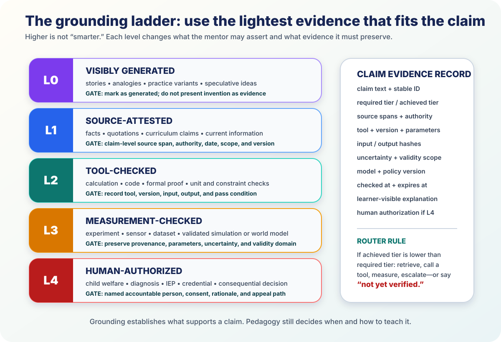

# The Grounding Ladder



*Every substantive claim receives a required tier and an achieved tier. If they
do not match, the mentor retrieves, checks, measures, escalates—or says that the
claim is not yet verified.*

A frontier model can explain almost anything. An expert mentor must also know
what permits it to make each claim.

The July 2026 tool stack makes this implementable. Search systems can return
claim-linked citation annotations. File tools can restrict answers to approved
curriculum. Code and formal systems can check calculations and proofs.
Provenance standards can preserve how an image or document was created. Human
review can be routed as a real authorization step rather than pasted on as a
disclaimer.

## 1. L0–L4

| Tier | Name | Appropriate use | Release gate |
|---|---|---|---|
| **L0** | Visibly generated | story, analogy, hypothetical, candidate example | mark as generated; do not present invention as evidence |
| **L1** | Source-attested | fact, quotation, curriculum claim, current information | exact source span, authority, date, version, and scope |
| **L2** | Tool-checked | calculation, code, formal proof, unit or constraint check | record tool, version, input, output, and pass condition |
| **L3** | Measurement-checked | experiment, sensor, dataset, validated simulation | preserve provenance, parameters, uncertainty, and validity domain |
| **L4** | Human-authorized | safeguarding, diagnosis, IEP, credential, consequential decision | accountable person, consent, rationale, and appeal path |

Higher is not always better. A metaphor belongs at L0. A historical date
belongs at L1. An arithmetic result belongs at L2. A claim about the physical
world may require L3. A decision affecting a child’s rights belongs at L4.

## 2. L0 — be imaginative and visible about it

The mentor should generate stories, analogies, examples, illustrations, games,
and speculative worlds freely. Their educational value does not depend on being
real.

The learner receives a simple cue: “I made this example to show the idea.”
Distributed media preserves its generation and edit history. [C2PA 2.4](https://spec.c2pa.org/specifications/)
provides a current interoperable content-provenance standard, while explicitly
separating provenance from truth. `STANDARD`

That distinction is liberating. The mentor can be creative without blurring an
illustration into evidence.

## 3. L1 — attach the exact source to the exact claim

Search-and-citation features are now built into frontier systems:

- [Gemini grounding](https://ai.google.dev/gemini-api/docs/google-search)
  returns inline citation annotations tied to output spans. `VENDOR`
- [OpenAI deep research](https://openai.com/index/introducing-deep-research/)
  can restrict web work to trusted sites and produces documented reports.
  `VENDOR`
- [Anthropic citations](https://docs.anthropic.com/en/docs/build-with-claude/citations)
  attach source locations to generated text. `VENDOR`

A citation is the beginning of verification, not the end. The mentor checks:

1. does the source exist?
2. does the quoted span support this claim?
3. is the source authoritative for this question?
4. is it current for the relevant date and version?
5. does the claim stay inside its scope?

Search ranking is not an authority policy. A curriculum claim may require the
local education authority. A study result requires the primary paper. A local
practice may require a community knowledge holder.

The learner-facing cue can remain simple: “This comes from your science book,
page 42.” The teacher can inspect the complete evidence record.

## 4. L2 — use an oracle when the domain has one

Do not ask language generation to approximate what a cheap, inspectable tool can
establish.

- send arithmetic to a calculator or code runtime;
- check units with a unit library;
- run software against tests and types;
- validate structured output against a schema;
- check a formal proof with an independent kernel.

Lean 4 is the strongest pattern: a model or human may construct a proof, but the
[Lean kernel](https://lean-lang.org/doc/reference/latest/) decides whether the
proof term is valid. `STANDARD`

The mentor says exactly what passed:

- “The calculation was recomputed.”
- “The program passed these six tests.”
- “The proof checker accepted every logical step.”

A tool does not establish more than its predicate. Passing tests does not prove
good product design. A valid proof does not prove that its definitions model
the intended physical situation. A compiling answer does not prove the learner
understands it.

## 5. L3 — connect models to measurements

Claims about the world need observations and a provenance chain:

- what was measured;
- when, where, and by whom;
- the device, dataset, specimen, or environment;
- units, protocol, parameters, and code;
- uncertainty and calibration;
- assumptions and validity domain.

[W3C PROV-O](https://www.w3.org/TR/prov-o/) provides interoperable primitives
for the entity, activity, and responsible agent behind a result. [NIST AI
600-1](https://www.nist.gov/publications/artificial-intelligence-risk-management-framework-generative-artificial-intelligence)
requires provenance methods themselves to be evaluated against known ground
truth. `STANDARD`

This enables bold use of generated worlds without mistaking visual plausibility
for evidence:

```text
imagined ecosystem             → L0
biology source                 → L1
checked population equations  → L2
comparison with field data    → L3
```

A simulation is L3 only inside a documented validation domain.

## 6. L4 — preserve accountable human authority

Some decisions require a person who has legal, professional, or relational
responsibility:

- child protection;
- diagnosis and treatment;
- individualized education plans;
- final grades and credentials;
- access to sensitive learner state;
- culturally consequential interpretation.

The AI remains useful. It can assemble evidence, translate, identify a pattern,
simulate options, and draft a plan. The decision path is:

```text
AI prepares → human understands → human decides → learner can contest
```

The record names the authorizer, evidence shown, consent basis, rationale,
review date, and appeal route.

## 7. The claim evidence record

Every consequential learner-visible claim stores:

```yaml
claim_id: clm_...
required_tier: L2
achieved_tier: L2
sources: [...]
tool: {name, version, input_hash, output_hash, predicate}
scope: "what this evidence establishes"
uncertainty: null
model_and_policy: [...]
checked_at: "..."
expires_at: null
human_authorization: null
learner_explanation: "I checked this calculation."
```

The full record is inspectable and portable. A correction supersedes the old
entry without erasing its provenance.

## 8. The offline mentor keeps its standards

A school or community node can carry:

- signed curriculum and primary-source bundles;
- local search indexes;
- calculators, unit libraries, code runtimes, and schema validators;
- compact proof checkers;
- versioned simulations;
- a queue for current-web and specialist escalation.

The mentor can continue L0 and locally supported L1/L2 work without a network.
For a current claim it gives the last synchronization date or waits to verify.
Weak connectivity changes latency, not truth standards.

## 9. Grounding and teaching are two coordinated policies

Grounding answers, “Why may this claim be trusted?” Pedagogy answers, “What
action advances this learner?”

```text
epistemic router  → source, tool, measurement, or human authority
pedagogical router → explain, demonstrate, question, practice, or create
```

A perfectly sourced answer may still be too advanced. A generated analogy may
be the perfect next explanation. The expert mentor mesh certifies both:
correctness and teaching judgment.

July 2026 systems are moving in this direction. [DeepTutor](https://arxiv.org/abs/2604.26962)
couples citation-grounded problem solving to personalized question generation.
[EduGuard](https://arxiv.org/abs/2607.15738) combines instructor-approved
retrieval, pedagogical policy, claim-level verification, and a bilingual
600-query benchmark. `MEASURED-BENCH`

## Conclusion

The grounding ladder lets the mentor be creative, current, computational,
empirical, and responsibly human-connected—without confusing those modes.

Every claim gets a route, record, release gate, and graceful failure behavior.
That is what turns a powerful model into an expert learning institution.

---

**Research basis:** [G1 raw research and source index](../research/raw/G1-grounding-ladder-2026.md)  
**Related:** [The expert mentor mesh](03-expert-mentor-mesh.md) ·
[The efficacy frontier](04-efficacy-frontier.md) ·
[Content roadmap](../CONTENT_ROADMAP.md)
