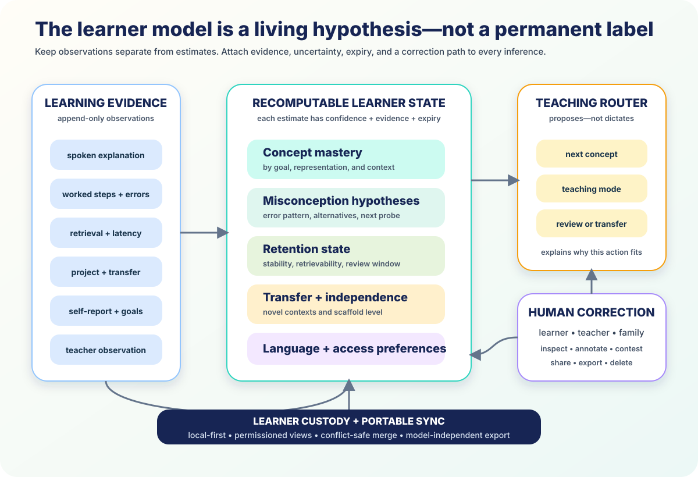

# The Learner-Owned State



*The learner model is a living hypothesis. Every estimate carries evidence,
uncertainty, expiry, and a correction path.*

The universal mentor should not forget the learner at the end of a chat. It
should accumulate understanding across lessons, subjects, projects, schools,
devices, and years.

That memory belongs to the learner.

> A child should be able to carry a trustworthy learning history from a shared
> village phone to a school server to a frontier mentor—without any vendor
> owning the authoritative copy and without any estimate becoming a permanent
> label.

## 1. Separate what happened from what the system thinks

The architecture has four parts:

| Part | Contains | Rule |
|---|---|---|
| Evidence | speech, work, errors, retrieval, projects, self-report, teacher observation | append-only observations |
| State | mastery, misconceptions, retention, transfer, language, access | recomputable hypotheses |
| Decisions | next concept, teaching mode, scaffold, review, escalation | explain the evidence and goal |
| Authority | learner, teacher, and family corrections and permissions | inspectable, contestable, portable |

An error does not become “this learner is weak at mathematics.” It becomes an
event. The system may infer a missing prerequisite or misconception, attach its
confidence, and schedule the cheapest probe that could confirm or reject it.

## 2. July 2026 makes richer state practical

[Interpretable Difficulty-Aware Knowledge Tracing](https://arxiv.org/abs/2605.01097)
now estimates both learner ability and the difficulty of a tutor’s next task
from dialogue, with explicit item-response parameters. `MEASURED-BENCH`

[DeepTutor](https://arxiv.org/abs/2604.26962) provides a shared
multi-resolution memory across grounded solving, difficulty-calibrated question
generation, writing, research, and proactive tutor agents. `MEASURED-BENCH`

[MemoryAgentBench](https://mlanthology.org/iclr/2026/hu2026iclr-evaluating/)
tests whether an agent retrieves, updates, and uses information across
incremental interactions. `MEASURED-BENCH`

A July 2026 peer-reviewed comparison held the foundation model constant and
found that a curated learner-state-aware pedagogical RAG workflow received
higher expert ratings than prompt-only tutoring for conceptual support,
instructional quality, and helpfulness: composite **4.65 versus 4.33** across 24
two-turn algebra episodes and eight reviewers. It did not test learners or
learning outcomes. `MEASURED-BENCH`

Source: [Frontiers in Education](https://www.frontiersin.org/journals/education/articles/10.3389/feduc.2026.1896839/abstract)

The frontier does not merely remember more text. It can turn structured memory
into a better next teaching action.

## 3. Mastery is a vector

For each goal, the state can represent:

- conceptual understanding;
- success across verbal, visual, symbolic, and physical representations;
- procedural fluency;
- misconception hypotheses;
- retention and predicted review window;
- transfer to novel contexts;
- independence from scaffolds;
- confidence calibration;
- language and accessibility preferences.

Each estimate stores evidence for and against, confidence, model version, update
time, expiry or decay, and the next useful probe.

A learner may remember a formula, explain it poorly, solve a familiar problem,
and fail to transfer it to a new setting. One “82% mastery” number would erase
the teaching opportunity.

## 4. Dialogue becomes diagnostic

A mentor conversation exposes evidence that clickstream models missed:

- where the reasoning changed;
- which hint unlocked progress;
- whether a mistake was conceptual, linguistic, or arithmetic;
- which representation made the relationship visible;
- whether the learner can explain the choice;
- whether the idea survives a fresh context.

The system keeps the observed work. Its estimate remains replaceable.

```yaml
estimate:
  goal: "proportional equivalence"
  dimension: transfer
  value: emerging
  confidence: 0.67
  evidence_for: [evt_a, evt_b]
  evidence_against: [evt_c]
  next_probe: "novel mixture problem without a table"
  learner_annotation: "The units confused me, not the ratio."
```

The learner’s annotation travels with the estimate.

## 5. Four memory horizons

| Horizon | What persists |
|---|---|
| Turn | current problem, visible work, immediate error |
| Session | active goal, successful explanation, unresolved question |
| Course | concept graph, misconceptions, projects, transfer, review schedule |
| Lifelong | learner-selected goals, achievements, portfolios, access preferences |

Summaries point back to evidence. A new model can recompute the course state
without replaying every private conversation to a vendor.

## 6. Retention is one dimension

The open [spaced-repetition benchmark](https://github.com/open-spaced-repetition/srs-benchmark)
currently evaluates approximately **349.9 million** filtered review events from
9,999 Anki collections and includes FSRS-7. `MEASURED-BENCH`

That makes memory scheduling unusually measurable. The mentor should maintain
retrievability and stability where scheduled recall helps.

But recall is not transfer. Retention sits beside conceptual, representational,
and real-world application evidence. F11 owns the scheduling science; the
learner state keeps it connected to the whole person.

## 7. Cold start is a first act of teaching

A short first conversation can gather:

1. the learner’s goal and urgency;
2. local curriculum or project context;
3. one broad diagnostic task;
4. a spoken or written explanation;
5. one prerequisite probe;
6. language and access preferences;
7. a first teach-practice-transfer cycle.

The result is a sparse state with wide uncertainty. The mentor begins helping
immediately and learns through normal instruction.

Imported records remain evidence, not destiny.

## 8. One state, many specialists

The subject expert, language mentor, visual teacher, practice coach, peer panel,
and teacher cockpit use one shared state. Each receives the minimum view needed
for its role.

The teaching router can ask:

- which prerequisite is uncertain?
- what misconception is worth probing?
- which representation has already helped?
- is this a learn, retrieve, or transfer moment?
- how much scaffold is necessary?
- what evidence will show the action worked?
- when should a person enter?

It logs alternatives, choice, expected signal, and outcome. A teacher can
override the plan. A learner can choose among several valid next actions.

## 9. Portability already has building blocks

| Need | Standard |
|---|---|
| Competency graph | [CASE 1.1](https://standards.1edtech.org/case/) |
| Learning events | [Caliper Analytics](https://standards.1edtech.org/caliper/) or xAPI |
| Achievements | [Comprehensive Learner Record 2.0](https://standards.1edtech.org/clr/) |
| Classes and official results | [OneRoster 1.2](https://standards.1edtech.org/oneroster/) |
| Provenance | [W3C PROV-O](https://www.w3.org/TR/prov-o/) |

The portable bundle contains selected raw events, derived estimates with model
metadata, competency identifiers, projects and achievements, annotations,
permission grants, and synchronization receipts.

A receiving mentor can use the estimates or recompute them.

## 10. Privacy comes from the data structure

- record only what can improve a learning decision;
- keep identity separate from learning evidence;
- give each specialist a scoped view;
- expire sensitive turn-level material;
- preserve achievements only when the learner chooses;
- make every estimate contestable;
- move custody from guardian to learner at the appropriate age;
- prohibit opaque provider embeddings as the only learner record.

Personalization and learner agency reinforce each other when the learner owns
the evidence.

## 11. Offline continuity

The authoritative state can live on a learner device or trusted school node.
Append-only events merge safely. Estimates recompute after synchronization.
Large media stays local unless shared. Signed curriculum bundles provide stable
competency IDs. Permissions travel with exported fields.

The mentor may use a cloud frontier model today and a local small model
tomorrow. The learner’s continuity survives the switch.

## 12. Acceptance tests

A learner state is ready when:

1. observations never silently become permanent ability labels;
2. estimates carry evidence, uncertainty, model version, and expiry;
3. a new model can recompute state from events;
4. retention and transfer remain distinct;
5. misconception hypotheses produce a next probe;
6. every specialist uses the shared state;
7. the router explains its proposed action;
8. learners and trusted adults can correct the record;
9. a standards-based export works in another implementation;
10. the complete core loop works offline;
11. permissions are scoped and expire;
12. state use improves delayed unaided learning.

## Conclusion

The learner model is the shared, portable memory of the expert mentor mesh.

Each explanation teaches the mentor. Each error becomes a hypothesis. Each
successful representation becomes reusable. Each retrieval updates the memory
plan. Each project adds transfer evidence. Each teacher correction improves the
next decision.

The child owns that continuity. Models and institutions compete to serve it.

---

**Research basis:** [C3/F5 raw research and source index](../research/raw/C3-F5-learner-owned-state-2026.md)  
**Related:** [The expert mentor mesh](03-expert-mentor-mesh.md) ·
[The grounding ladder](05-grounding-ladder.md) ·
[Content roadmap](../CONTENT_ROADMAP.md)
