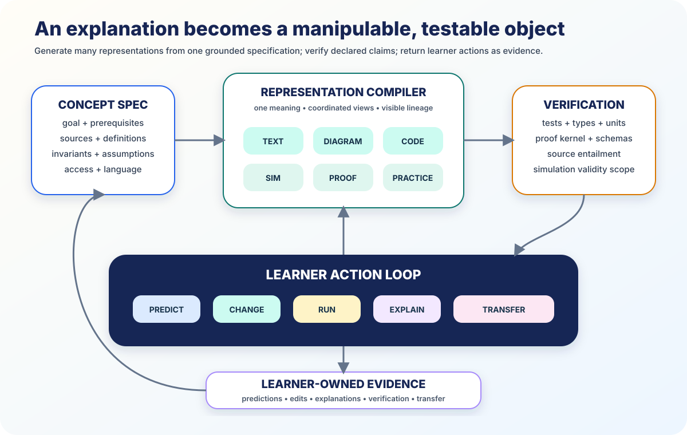

# Executable Knowledge



*The learner predicts, changes, runs, explains, and transfers. The artifact’s
validity and the learner’s capability remain separate claims.*

The static page is no longer the natural unit of digital learning.

By July 2026, frontier systems can generate interactive apps, SVG diagrams,
simulations, code, plots, and editable artifacts from conversation. Scientific
Python can execute inside a browser. Tests, unit checkers, schemas, and proof
kernels can verify declared properties.

> A concept can compile into coordinated text, diagram, simulation, code, proof,
> and practice views that the learner can change—and each checkable claim can
> carry its verifier.

## 1. The threshold has crossed

- ChatGPT now presents interactive math and science modules with manipulable
  formulas and variables. `VENDOR`
- [Claude Artifacts](https://support.anthropic.com/en/articles/9487310-what-are-artifacts-and-how-do-i-use-them)
  generates editable HTML, SVG, React apps, diagrams, and code with versioning
  and forking. `VENDOR`
- The [Gemini code-execution tool](https://ai.google.dev/gemini-api/docs/code-execution),
  updated 21 July 2026, lets a model generate Python, inspect results, and
  iterate with scientific and plotting libraries. `VENDOR`
- [JupyterLite](https://jupyterlite.readthedocs.io/),
  [Pyodide](https://pyodide.org/), and
  [marimo WASM](https://docs.marimo.io/guides/wasm/) run notebook-like
  computation in a browser. `STANDARD`, shipping open source

This is not a forecast. The building blocks exist. The research task is to turn
them into learning objects rather than impressive demos.

## 2. Begin with a concept contract

Every generated object starts from one versioned specification:

```yaml
concept: "conservation of energy on a frictionless track"
goal: "predict speed from height"
sources: [...]
definitions: [...]
assumptions: ["no friction", "constant gravitational field"]
invariant: "m*g*h + 0.5*m*v^2 is constant"
controls: [mass, initial_height]
learner_actions: [predict, vary, explain, transfer]
verification:
  units: true
  tolerance: 1e-9
access:
  keyboard: true
  screen_reader_summary: true
  reduced_motion: true
```

Text, diagram, code, simulation, and practice renderers consume the same
definitions, symbols, units, assumptions, and sources. Change the contract and
all views update together.

## 3. Generate representations, not decoration

One concept may become:

- a short spoken explanation;
- an annotated SVG;
- a draggable manipulative;
- executable equations and graphs;
- a formal derivation;
- a physical activity using local objects;
- guided practice and a transfer challenge;
- equivalent audio, high-contrast, keyboard, and reduced-motion paths.

The device tier changes the representation, not the goal. A basic phone may use
a static diagram plus numeric inputs. A school laptop may run a local Python
simulation. A lab may connect the same model to sensor data.

## 4. Attach the right verifier

| Claim | Grounding | Check |
|---|---|---|
| imagined world or analogy | L0 | visible generation label |
| curriculum fact | L1 | exact source span |
| equation, unit, proof, or code property | L2 | calculator, symbolic tool, tests, or proof kernel |
| prediction about a real system | L3 | experiment, calibration, residuals |
| credential or consequential judgment | L4 | authorized educator |

[SymPy](https://docs.sympy.org/) can check symbolic work,
[Pint](https://pint.readthedocs.io/) can check units,
[JSON Schema](https://json-schema.org/specification) can validate a lesson
contract, and [Lean 4](https://lean-lang.org/doc/reference/latest/) can check a
formal proof term.

A pass means only what the predicate says. A program passing six tests does not
prove good design. A valid equation under frictionless assumptions does not
prove a real cart has no friction. The mentor shows the boundary.

## 5. Put the learner in the execution loop

The core interaction is:

1. **Predict** before execution.
2. **Change** a variable, assumption, representation, or code.
3. **Run** and observe.
4. **Explain** the result.
5. **Verify** with the attached source or tool.
6. **Compare** prediction with result.
7. **Transfer** to a fresh case.

The learner-owned state records the prediction, edit, explanation, help used,
and transfer—not merely a click on “run.”

## 6. Artifact truth and learner capability are separate

A proof checker can establish that an artifact is valid. It cannot establish
that the learner understands it.

Cheap verification should free the mentor to ask richer questions:

- Why is this the right invariant?
- Which assumption did the test leave out?
- What input would break the model?
- Can you sketch the graph before running it?
- Can you rebuild the relationship in another representation?
- How would the result change in the real world?

The verified artifact becomes the ticket to explanation and transfer, not the
final grade.

## 7. Make generated execution safe and reproducible

Every runtime needs:

- CPU, memory, and time limits;
- no ambient secrets or network;
- allowlisted libraries;
- immutable environment and ephemeral files;
- deterministic seeds when possible;
- captured output, warnings, errors, and plots;
- dependency and input hashes;
- reset and replay.

[WebAssembly](https://webassembly.github.io/spec/core/) supports portable local
execution. Routine work can stay on the learner device; heavier work can move
to the school node or regional sandbox.

## 8. Visual correctness and accessibility are also tested

The pipeline checks that:

- labels, axes, units, scales, and legends match the concept contract;
- controls preserve invariants over their full range;
- color is not the only information channel;
- keyboard, screen reader, touch, and voice reach equivalent goals;
- focus order and reduced motion work;
- a static fallback remains useful offline.

[WCAG 2.2](https://www.w3.org/TR/WCAG22/) supplies the access floor.
[C2PA](https://spec.c2pa.org/specifications/) preserves generated-media
provenance. `STANDARD`

The July 2026 [ShadowAI](https://doi.org/10.1145/3803784.3816815) installation
shows another direction: children use tangible making and generated stories,
images, and reasoning visualizations to discuss how AI works. `OBSERVED`

## 9. Package the laboratory for weak connectivity

An offline bundle can include the concept specification, sources, HTML
explanation, SVG, JavaScript manipulative, notebook, tests, accessible
alternatives, claim records, and provenance.

The school node generates or updates bundles when connected. The learner runs
the lightweight view locally and synchronizes learning evidence later.

Offline changes latency—not the correctness standard.

## Conclusion

Frontier AI makes custom learning software cheap enough to generate for one
learner and one moment. Verification makes its checkable core trustworthy.
Browser runtimes make it globally distributable.

The textbook page becomes a laboratory, studio, proof assistant, and practice
partner—generated on demand, inspectable, modifiable, and owned by the learner.

---

**Research basis:** [F3 raw research and source index](../research/raw/F3-executable-knowledge-2026.md)  
**Related:** [The grounding ladder](05-grounding-ladder.md) ·
[The learner-owned state](06-learner-owned-state.md) ·
[Content roadmap](../CONTENT_ROADMAP.md)
