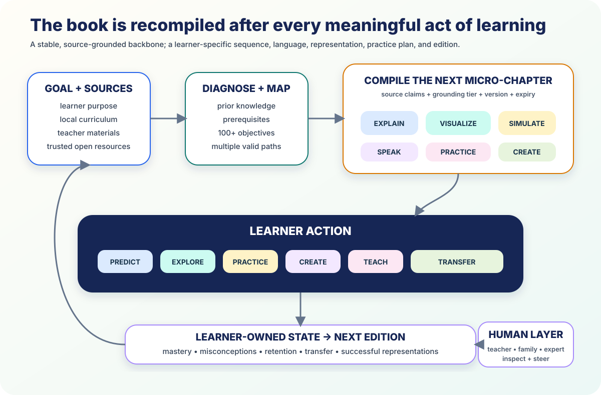

# The AI-Native Textbook



*A stable, source-grounded backbone; a learner-specific sequence, language,
representation, practice plan, and edition.*

The AI-native textbook is not a PDF with a chat box. It is a continuously
compiled course.

> A trusted concept and competency backbone becomes a learner-specific sequence
> of explanations, visuals, simulations, practice, projects, and reviews.
> Meaningful learner action updates the state and compiles the next edition.

It keeps the intellectual map and source discipline of a great book. It adds the
responsiveness of an expert mentor.

## 1. The product primitive arrived in 2026

[Gemini Study Notebooks](https://blog.google/innovation-and-ai/products/gemini-app/gemini-study-notebooks/)
now accepts a goal and class materials, creates a diagnostic, identifies
strengths and gaps, decomposes the goal into more than 100 objectives, generates
short lessons and source-grounded quizzes, updates a skill dashboard, and
recommends the next lesson. It synchronizes sources with NotebookLM. `VENDOR`

[ChatGPT dynamic visual explanations](https://openai.com/index/new-ways-to-learn-math-and-science-in-chatgpt/)
make more than 70 core math and science relationships manipulable in real time.
[Claude Artifacts](https://support.anthropic.com/en/articles/9487310-what-are-artifacts-and-how-do-i-use-them)
creates editable apps, SVGs, code, diagrams, and visualizations. `VENDOR`

The pieces are no longer hypothetical. The task is to integrate and evaluate
them as a course.

## 2. Adaptive curriculum now has randomized evidence

A 2026 pre-registered randomized study assigned 270 university students to
static or generative adaptive curricula. The adaptive condition reported larger
pre/post improvement: **24.2% versus 10.2%, Cohen’s d=1.03**. It also reported
lower cognitive load and stronger complex problem-solving performance.
`MEASURED-RCT`

Source: [Discover Artificial Intelligence](https://link.springer.com/article/10.1007/s44163-026-01264-6)

The study covers one internet-connected university course, and this survey does
not adopt its “learning style” framing. The useful adaptation variables are
prior knowledge, pace, task difficulty, language, accessibility, observed
performance, and learner goal.

The broader efficacy portfolio—Sierra Leone, Nigeria, India, and July 2026
knowledge-acquisition experiments—shows that adaptive digital learning works
best as a complete service: grounded content, meaningful dose, teacher support,
and independent checks.

## 3. Keep a stable spine

The trusted backbone contains:

- curriculum goals and competency identifiers;
- prerequisites and several valid paths;
- versioned source library;
- definitions, symbols, units, and assumptions;
- common misconceptions and probes;
- representation and accessibility specifications;
- verified examples, tests, and rubrics;
- safety and credential boundaries.

[CASE 1.1](https://standards.1edtech.org/case/) provides machine-readable
competency frameworks. The grounding ladder provides a claim contract.

The AI does not rewrite truth for every learner. It compiles the best route into
it.

## 4. Compile one micro-chapter at a time

The edition can adapt:

- next objective and prerequisite;
- explanation depth;
- strongest language;
- spoken, visual, symbolic, textual, or physical entry;
- direct example, guided inquiry, or creation;
- scaffold amount and fading;
- local context;
- practice and review timing;
- device and connectivity tier.

The learner can always browse the full map. Recommendation does not become a
hidden track.

```text
goal + trusted sources
        ↓
short diagnostic
        ↓
objective graph
        ↓
compile one grounded micro-chapter
        ↓
explain → predict → explore → practice → create → teach → transfer
        ↓
independent evidence
        ↓
update state and compile the next edition
```

## 5. The learner becomes a co-author

The book can preserve learner-made:

- explanations and annotated examples;
- corrected misconceptions;
- diagrams, simulations, proofs, and programs;
- projects and field observations;
- questions and debates;
- reflections on what changed their mind.

The learner chooses what enters the durable edition. The mentor verifies claims
and preserves provenance.

Over years, the book records not only what the domain contains but how this
learner learned, created, and transferred it.

## 6. Navigation still matters

An adaptive course needs more orientation, not less:

- a zoomable goal and prerequisite map;
- “you are here” and “why this is next”;
- several route options;
- completed, active, uncertain, and future goals;
- exam, project, and curiosity paths;
- time and device estimates;
- the freedom to ignore the recommendation and explore.

The dashboard maps evidence and possibilities. It does not rank the child.

## 7. Teachers and families receive useful editions

The teacher view shows prerequisites, misconception hypotheses,
representations attempted, who needs a small group, source exceptions, and
upcoming transfer checks.

The family view offers questions in the family’s strongest language, household
or community examples, and an easy way to add local context.

AI turns the adults around the learner into a better coordinated team.

## 8. Mother tongue is part of the semantic spine

The course maintains curriculum-aligned terminology, local-language definitions
and audio, stable notation, local examples, and community-reviewed material.
Language quality is evaluated through learning outcomes, not merely translation
fluency.

The [UNESCO Bhasha Matters report](https://articles.unesco.org/sites/default/files/medias/fichiers/2026/03/Bhasha%20Matters%20State%20of%20the%20Education%20Report%20of%202025%20on%20Mother%20Tongue%20and%20Multilingual%20Education.pdf)
centers mother tongue and multilingual education and documents emerging
adaptive companions in India. `OBSERVED`

## 9. The edition travels offline

A signed bundle can contain:

- objective map and source excerpts;
- HTML, SVG, and audio;
- WebAssembly manipulatives;
- practice and delayed review queue;
- learner-state delta;
- claim and content provenance.

[EPUB 3.3](https://www.w3.org/TR/epub-33/) offers an accessible publication
container. JupyterLite and Pyodide provide browser-local computation.

A school node updates the bundle when connected. The learner continues with
local explanation, practice, and evidence capture. Hard questions wait for the
regional mentor.

## 10. The new editorial workflow

Experts define the concept graph and source policy. The compiler generates
candidate editions. Automated checks validate sources, units, code, schemas,
and invariants. Teachers inspect failure clusters rather than every page. Real
learner outcomes improve the generator centrally.

Under abundant generation, the edited object is the **course compiler**, not a
million individual pages.

## Conclusion

The AI-native textbook is coherent but never finished, personalized but never
opaque, global but locally grounded, dynamic but still inspectable and owned.

It can give every learner a world-class course in their language, on their
device, following a route that responds to what they know and where they want
to go.

---

**Research basis:** [A1 raw research and source index](../research/raw/A1-ai-native-textbook-2026.md)  
**Related:** [Executable knowledge](07-executable-knowledge.md) ·
[The learner-owned state](06-learner-owned-state.md) ·
[Content roadmap](../CONTENT_ROADMAP.md)
