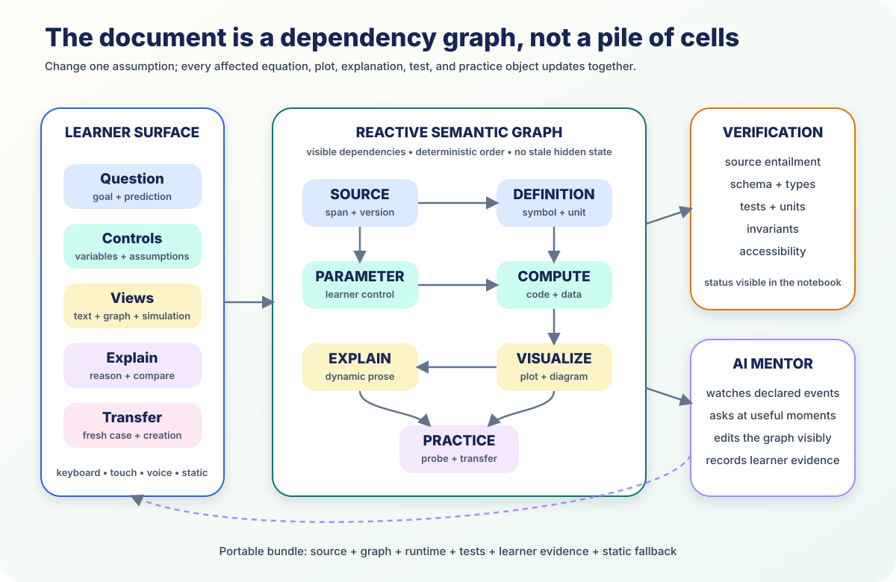

# Reactive Learning Documents



*The document is a graph, not a pile of cells. Change one assumption and every
affected equation, plot, explanation, test, and practice object updates.*

The notebook should not be a sequential transcript whose visible cells disagree
with hidden session state.

The AI-native substrate is a **reactive semantic graph** connecting sources,
definitions, parameters, computations, visualizations, explanations, tests, and
practice.

## 1. Reactivity makes causality visible

[Pluto 1.0](https://plutojl.org/en/docs/reactivity/) analyzes assignments and
references, builds a dependency graph, deletes removed variables, and
automatically reruns downstream cells. [marimo](https://docs.marimo.io/guides/reactivity/)
brings reactive execution, composable UI, SQL, testing, and application export
to Python. `STANDARD`, shipping open source

The 2025 [Rex benchmark](https://arxiv.org/abs/2511.21994) tests whether systems
actually maintain their claimed reactive semantics. `MEASURED-BENCH`

For learning, this means the learner can see:

- what changed;
- what depends on it;
- what reran;
- which claim became invalid;
- which source or test supports the new result.

## 2. Cells have semantic roles

| Role | Contains |
|---|---|
| Source | exact authoritative span and version |
| Definition | term, symbol, unit, assumption |
| Parameter | meaningful learner control |
| Data | observation with provenance |
| Compute | code, formula, proof, transformation |
| View | dynamic text, plot, diagram, simulation |
| Practice | prediction, probe, creation, transfer |
| Reflection | learner explanation or correction |

The AI can change a view without silently replacing a source. Tests and units
are part of the document rather than an invisible build step.

## 3. One changed assumption updates every view

In an energy notebook, the learner turns friction on. The graph updates:

- equation;
- table;
- plot;
- animation;
- prose explanation;
- invariant tests;
- example;
- transfer problem.

It cannot retain the frictionless claim that mechanical energy stays constant.

Before execution, the learner predicts which nodes should change. The
dependency graph becomes a model of the concept.

## 4. The mentor edits visibly

The AI operates through structured actions:

```text
inspect node
explain dependency
propose patch
run affected graph
show verification
fork scenario
create probe
record learner explanation
```

Every edit is a diff the learner can accept, modify, reject, or revert. The
graph records its model, sources, and tools.

Current products provide the pieces. Gemini can iteratively run Python and
inspect output. Claude Artifacts creates versioned interactive apps. NotebookLM
now uses a secure cloud computer for code, charts, spreadsheets, and slides.
`VENDOR`

## 5. Proactive help uses declared events

The graph can signal repeated test failure, changed assumptions, a submitted
prediction, an inconsistent explanation, or a completed transfer attempt.

The mentor intervenes at those meaningful boundaries.

The July 2026 [SCALA deployment](https://aclanthology.org/2026.acl-industry.107/)
in a 1,500-plus-student Python course generated likely student questions before
lectures. Learners frequently selected them, and they substantially overlapped
real questions. `OBSERVED`

Proactivity can be useful without becoming interruption spam when its triggers
are explicit.

## 6. The browser is an offline lab

[JupyterLite](https://jupyterlite.readthedocs.io/) runs a notebook environment
in the browser. [Pyodide](https://pyodide.org/) provides CPython and scientific
libraries through WebAssembly. [marimo WASM](https://docs.marimo.io/guides/wasm/)
exports reactive Python applications for static hosting.

A learner bundle carries:

- graph and source excerpts;
- browser runtime;
- data and dependency hashes;
- tests and claim records;
- accessible static views;
- learner-event queue.

The shared phone, school laptop, and regional sandbox execute different tiers
of the same graph.

## 7. Narrative and machinery coexist

The graph can render as a guided story, traditional notebook, dashboard,
simulation, spoken lesson, expert editor, or printed path.

Beginners manipulate one control. Intermediate learners inspect equations.
Advanced learners edit code, tests, and source mappings.

Reactive does not mean every child sees an IDE. It means every view stays true
to the same state.

## 8. Branches preserve authorship

Learners, peers, teachers, and mentors fork scenarios rather than overwrite one
another.

- independent cells merge;
- competing definitions require a decision;
- source changes invalidate dependents;
- learner reflections never disappear;
- tests rerun after merge.

The learner-owned state references notebook event and version IDs.

## 9. Digital and physical worlds connect

The notebook can receive a pendulum measurement, water temperature, phone-camera
track, paper circuit result, or physical sorting-network observation.

July 2026 research with 9–10-year-olds using the mechanical
[Turing Tumble](https://link.springer.com/article/10.1007/s10763-026-10698-4)
found strong reliance on iterative testing and debugging. An April 2026
[AI Unplugged](https://doi.org/10.1145/3786761) study used physical simulation to
make machine-learning reasoning tangible for young adolescents. `OBSERVED`

The reactive document connects the measured world to the executable model.

## Conclusion

Reactive learning documents keep explanation, code, data, visualization,
verification, and practice in one inspectable causal structure.

The learner changes the model, predicts the consequences, and understands why
the result moved. The mentor acts through the same graph, and every interaction
can become portable learning evidence.

---

**Research basis:** [A3 raw research and source index](../research/raw/A3-reactive-notebooks-2026.md)  
**Related:** [The AI-native textbook](08-ai-native-textbook.md) ·
[Executable knowledge](07-executable-knowledge.md) ·
[Content roadmap](../CONTENT_ROADMAP.md)
