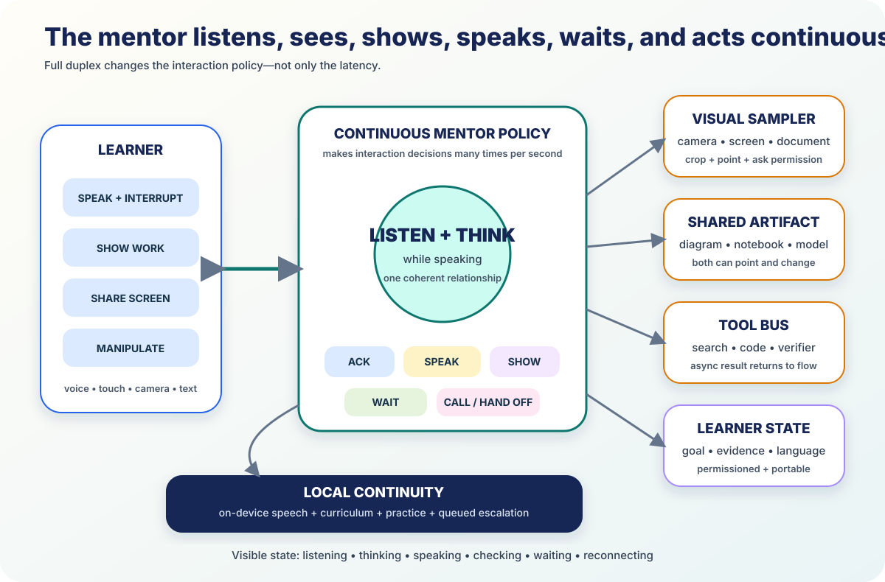

# The Live Multimodal Mentor



*Full duplex changes the interaction policy—not only the latency.*

The voice interface crossed a qualitative threshold in July 2026.

[GPT-Live](https://openai.com/index/introducing-gpt-live/) continuously listens
while speaking and decides many times per second whether to acknowledge, talk,
wait, interrupt, or invoke a tool. [Gemini Live](https://ai.google.dev/gemini-api/docs/live-api/capabilities)
accepts realtime audio and video frames through an API, supports barge-in,
search, functions, resumption, and 97 documented languages. `VENDOR`

> A mentor can now feel continuously present: listen while speaking, notice
> interruption, share silence, see selected work, point to a generated object,
> call specialists, translate, and preserve one relationship across modalities.

## 1. Continuous interaction is the breakthrough

GPT-Live can backchannel, overlap in quick exchanges, remain quiet while a
learner thinks, and delegate hard work in the background. At the 25 July cutoff,
it ships in ChatGPT Voice; its API is still announced as coming soon, and the
GPT-Live-1 path does not yet combine voice with video or screen sharing.
`VENDOR`

Gemini provides the current developer surface: WebSocket audio, text, images,
and video frames; configurable or manual activity detection; interruption;
search and function calls; context compression; and session resumption.
`VENDOR`

The wrapper must reconnect and preserve what the learner actually heard. A
realtime model alone is not the mentor.

## 2. The mentor chooses an action moment by moment

```text
listen
acknowledge
ask
explain
show
point
wait
call a tool
call a specialist
invite a teacher or peer
```

Silence is a first-class action. A mentor that answers every sound is not
attentive.

The policy reads learner speech, interruption, visible work, goal, teaching
mode, prediction state, recent errors, language, tool status, and consent scope.

## 3. Translation becomes part of the relationship

[Gemini 3.5 Live Translate](https://blog.google/innovation-and-ai/models-and-research/gemini-models/gemini-live-3-5-translate/)
reports automatic detection across more than 70 languages and more than 2,000
pairs while preserving intonation, pacing, and pitch. `VENDOR`

The learning architecture preserves original speech, translation, subject
terminology, alternate renderings, explanation language, and notation language.

Fluent translation is not language parity. Learning outcomes still need to be
tested in each language.

## 4. Seeing is learner-scoped

The mentor can receive a selected camera frame, notebook crop, screen region,
document page, artifact node, or short motion sequence.

The interface says:

- camera off;
- looking at this crop;
- screen shared until this step ends;
- frame sent to a specialist;
- image retained only locally.

The learner points or grants access. The mentor asks before expanding scope.

## 5. The shared object is the visual center

The most useful face of the mentor is often a diagram, reactive notebook,
number line, code trace, simulation, proof, or annotated camera crop.

Both parties can point and change it. Spoken references resolve to stable node
IDs.

An avatar may help language rehearsal or learners who benefit from facial cues.
It is an optional representation, not the core of live tutoring.

## 6. Tools return without breaking flow

Search, curriculum retrieval, calculation, code, OCR, proof checking, visual
generation, and specialists may take time.

The mentor can state what it is checking, invite a prediction, continue a
related explanation, and return the verified result when appropriate.

Tool status and evidence remain visible on the shared artifact.

## 7. Local speech keeps the relationship alive

Current components include [Sarvam Edge](https://www.sarvam.ai/products/edge)
for vendor-reported local speech and translation across 22 Indian languages,
[Meta Omnilingual ASR](https://ai.meta.com/blog/omnilingual-asr-advancing-automatic-speech-recognition/)
for open recognition across 1,600-plus languages, and
[Voxtral](https://mistral.ai/news/voxtral/) edge speech models. `VENDOR` or
vendor-run benchmarks

The device or school node handles wake, push-to-talk, recognition, synthesis,
curriculum search, routine practice, and state capture. Hard cases queue for the
cloud or a person.

## 8. Full duplex is not voice-only

Equivalent access paths include:

- captions and editable transcript;
- keyboard, switch, touch, and voice control;
- push-to-talk for noise or privacy;
- slower and chunked speech;
- visible listening, thinking, checking, and reconnecting states;
- no-camera and no-audio modes;
- replay and pronunciation correction;
- interpreter or trusted-person handoff.

The goal remains stable across modes.

## 9. Evaluate the interaction and the learning

Component metrics include latency, interruption recovery, false turn ends,
speech accuracy, visual reference accuracy, reconnect continuity, and cost.

Interaction metrics include learner speak-over, useful silence, time explaining,
misunderstanding repair, shared-object references, and teacher handoff.

The decisive metrics remain delayed unaided learning, transfer, independence,
language parity, distributional gains, and cost per successful learning hour.

Voice naturalness is not the endpoint.

## Conclusion

Full duplex turns the mentor from recorded voice messages into a continuous
collaborator.

For the learner it should feel simple: show your work, speak in your language,
interrupt when the mentor is wrong, change the shared object, and keep going—
even when the network is weak.

---

**Research basis:** [A4 frontier research and source index](../research/raw/A4-live-multimodal-frontier-2026-07-25.md)
**Related:** [Reactive learning documents](09-reactive-learning-documents.md) ·
[The expert mentor mesh](03-expert-mentor-mesh.md) ·
[Content roadmap](../CONTENT_ROADMAP.md)
