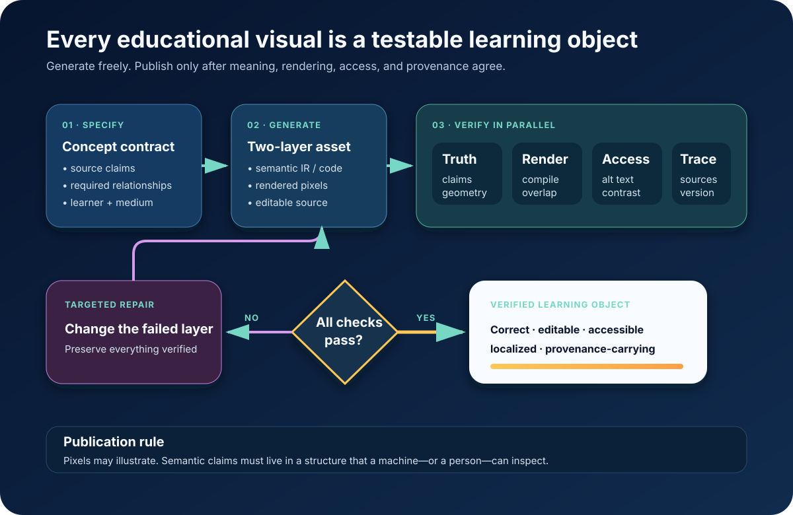

# The Verified Visual

*Generate freely. Publish only when meaning, rendering, access, and provenance
agree.*

In 2026, the scarce thing is no longer the ability to draw.

[ChatGPT Images 2.0](https://openai.com/index/introducing-chatgpt-images-2-0/)
can research, reason, transform source material, create dense layouts, render
text, and revise a visual through conversation. Google’s current
[native image family](https://ai.google.dev/gemini-api/docs/image-generation)
offers grounded professional generation, multi-reference consistency,
conversational editing, low-latency variants, and output up to 4K. `VENDOR`

An expert AI mentor can therefore draw for *this* learner:

- the force diagram that directly addresses their misconception;
- the cell cross-section labeled in their strongest language;
- the same geometric proof as a tactile construction;
- a historical scene built around their town’s architecture;
- a manipulable graph of the function they just wrote;
- a print-ready version for a classroom with intermittent connectivity.

This is not a media-library improvement. It removes the assumption that every
learner must adapt to the same canonical figure.

The remaining question is exact: **can the machine draw a correct figure?**

The answer is yes—if the figure is built as a verified learning object rather
than accepted as a pretty bitmap.

## The frontier result

New 2025–26 evaluations give us both capability and method:

- [SciFig](https://arxiv.org/abs/2601.04390) generates publication-style
  pipeline figures through hierarchical layout plus iterative visual feedback
  and reports 70.1% overall quality on dataset evaluation. `MEASURED-BENCH`
- [VectorGym](https://arxiv.org/abs/2603.29852) treats SVG generation, editing,
  sketch conversion, and understanding as one structured visual capability.
  `MEASURED-BENCH`
- [DiagramIR](https://arxiv.org/abs/2511.08283) shows that checking the
  intermediate structure of a geometry figure aligns better with humans than
  judging only the rendered image. `MEASURED-BENCH`
- A [10 July 2026 study](https://arxiv.org/abs/2607.09839) applies an agentic
  generate–inspect–repair loop specifically to K–12 math visual aids.
  `MEASURED-BENCH`
- Educator ratings of 150 generated computing diagrams found that structured
  examples improve faithfulness while a generator’s own error detection remains
  unreliable. `MEASURED-BENCH`
  ([study](https://arxiv.org/abs/2601.20476))

The conclusion is optimistic and implementable: **generation has become
abundant; verification must become automatic.**

## The two-layer visual

Every exact educational figure has two synchronized layers.

### Layer 1: meaning

A semantic contract records:

- what concept is being taught;
- what the learner currently believes;
- which entities and relationships must appear;
- exact values, labels, units, directions, and invariants;
- which details may be simplified;
- which implications may never be falsified;
- what action the learner should take.

### Layer 2: expression

The same contract can render as:

- SVG or TikZ;
- an interactive canvas;
- a simulation;
- a narrated sequence;
- a tactile construction;
- a printable monochrome page;
- a culturally situated illustration;
- a low-bandwidth verbal description.

This separation means localization does not redraw the science, accessibility
does not become an afterthought, and one layout fix does not reopen the approved
content.

## Representation follows the claim

| If the lesson depends on… | Generate… | Verify… |
|---|---|---|
| exact geometry or topology | SVG/TikZ/scene graph | lengths, angles, adjacency, labels |
| quantitative data | chart code + source table | values, axes, units, encodings |
| change under intervention | executable simulation | state transition and invariants |
| place, story, or analogy | generated imagery | required elements and forbidden implications |
| spatial manipulation | constrained 3D scene | collision, scale, object state |
| no screen or low vision | verbal/tactile equivalent | semantic coverage and order |

Raster generation is not inferior. It is simply the wrong authority for a claim
like “these two angles are equal” unless equality is independently represented
and checked.

## The publication gate

The mentor may sketch instantly in conversation. A visual that becomes teaching
material passes four gates.

### 1. Truth

Every entity, value, arrow, unit, scale, relationship, and causal direction
matches the concept contract, a cited source, or an executable derivation.

### 2. Render

The asset compiles. Text is not clipped. Labels do not collide. Mobile, print,
grayscale, and translated versions remain legible.

### 3. Access

Color is redundant with shape or text. Reading order is explicit. The asset has
useful alt text or a full structured alternative. The
[W3C image guidance](https://www.w3.org/WAI/tutorials/images/) and
[WCAG 2.2](https://www.w3.org/TR/WCAG22/) are the floor.

### 4. Trace

The bundle retains source claims, model and version, prompt or generation code,
revision history, verification results, and synthetic-media provenance.

Failure does not discard the whole visual. It opens a targeted repair:
relationship, layout, translation, access description, or provenance.

## What the mentor actually does

The mentor does not answer every question with a generated poster. It chooses the
smallest visual action that unlocks the learner’s next thought:

1. point to their own work;
2. annotate one region;
3. make a quick conversational sketch;
4. render an exact structured diagram;
5. expose a parameter in a simulation;
6. generate a place-rich image or analogy;
7. ask the learner to predict, manipulate, label, compare, or reconstruct it.

The last step matters most. A visual becomes instruction when the learner *does*
something with it.

## Universal access changes the design

The same structured asset can travel much farther than a large opaque image.

- A village hub caches vector source and tiny raster derivatives.
- A shared phone receives only the changed layer.
- A teacher prints a monochrome version without losing meaning.
- Labels can move when translated into Hindi, Swahili, Mandarin, Arabic, or a
  local language.
- A blind learner receives the ordered relationship graph and a tactile build.
- A learner with visual-processing difficulty receives a reduced-complexity
  rendering from the same contract.
- A local model edits labels and layout; a regional or frontier model is invoked
  only when new semantic construction is needed.

This is one more place where accessibility-first architecture lowers cost for
everyone.

## The standard

A world-class universal mentor should be able to produce a new visual for every
learner who needs one. The standard is:

> **No educational pixel without a semantic source; no exact claim without a
> check; no visual without an equivalent path to the concept.**

That turns image generation from content abundance into learning abundance.

**Research basis:** [C1 frontier research and source index](../research/raw/C1-verified-visual-generation-2026.md)
