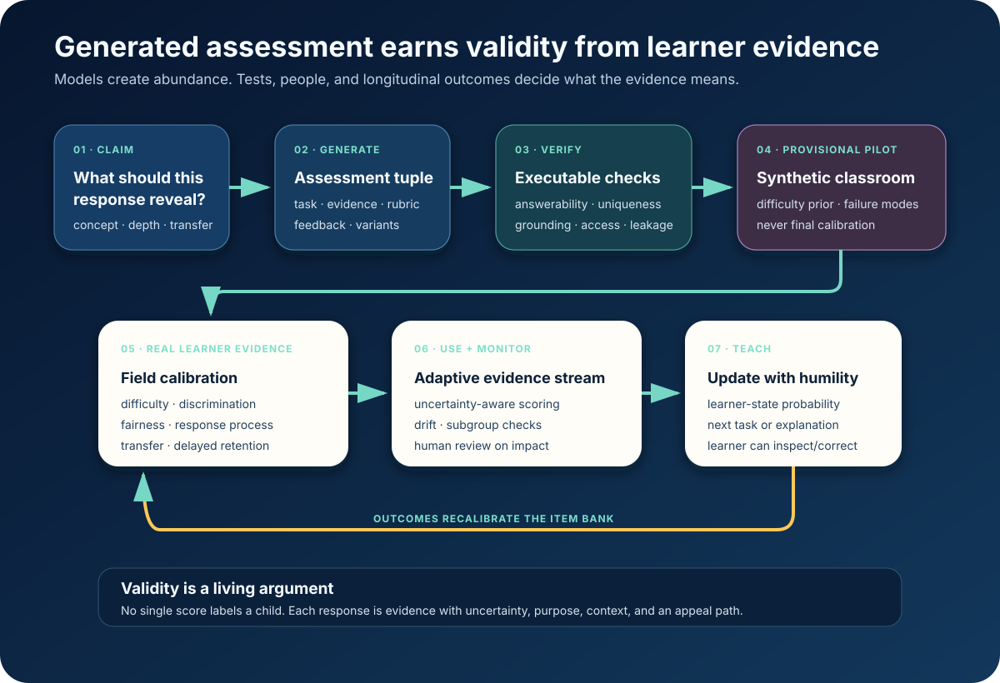

# Assessment as a Living Evidence Stream



*Models create abundance. Real learner evidence determines what an item means.*

The universal mentor does not need to choose between mass assessment and expert
assessment. It can generate a precise new evidence task for one learner, score
multiple forms of work, and improve the item bank from every consented response.

The breakthrough is not unlimited quizzes. It is the end of the quiz as the
default unit of knowing.

A learner can demonstrate understanding by:

- explaining a choice aloud;
- predicting what a simulation will do;
- reconstructing a diagram;
- showing intermediate mathematical work;
- writing code against tests;
- creating a challenge for someone else;
- demonstrating a physical procedure through a camera;
- transferring an idea to a new setting;
- retrieving and applying it after a delay.

Each action becomes evidence about a narrowly stated claim, with uncertainty. The
mentor uses that evidence immediately to choose the next explanation, problem,
tool, collaborator, or pause.

## What July 2026 evidence establishes

### Generated parallel forms can work

[Löber et al.](https://aclanthology.org/2026.bea-1.30/) used GPT-4o to construct
parallel forms for validated sentence-repetition tests. The study found no
significant difference in linguistic complexity and only minor psychometric
differences, while noting a change in grammatical-structure distribution.
`MEASURED-BENCH`

This does not prove every generated question is valid. It proves that generated
items can become assessment-grade when the domain, contract, comparison form,
and empirical validation are concrete.

### Synthetic classrooms can save real calibration work

A July 2026
[ACL study](https://aclanthology.org/2026.findings-acl.1807/) simulated grade 4,
8, and 12 classrooms with open models, fitted item-response models to their
answers, and compared predicted difficulty with real NAEP statistics. Reported
correlations reached 0.75, 0.76, and 0.82. `MEASURED-BENCH`

A separate [5,170-item K–5 study](https://arxiv.org/abs/2504.08804) found that
structured feature extraction plus tree models could reach reported difficulty
correlations as high as 0.87. `MEASURED-BENCH`

This creates a cheap and powerful preflight: generate thousands of candidates,
simulate diverse strategies, discard obvious failures, and send only the most
informative items to real pilots.

### Real learners still establish discrimination

The hardest property is not whether an item is “easy.” It is whether performance
actually distinguishes the human capability the item claims to measure.

A June 2026 [study of 42 models](https://arxiv.org/abs/2606.18709) found a best
direct discrimination correlation of 0.152 and a best synthetic-response
correlation of 0.241. `MEASURED-BENCH`

The design boundary is therefore clean:

> **Synthetic learners estimate priors and expose failure modes. Human learner
> evidence calibrates interpretation, fairness, and consequence.**

## Generate a bundle, not a question

A trustworthy assessment object contains:

| Part | Purpose |
|---|---|
| Claim | What capability this response can reveal |
| Task | What the learner does |
| Evidence | Which observable features support or weaken the claim |
| Rubric | Correct, partial, alternative, and counterexample states |
| Feedback | What teaching action follows each state |
| Variants | Parallel forms that preserve the same cognitive work |
| Provenance | Sources, generator, model/version, review history |
| Calibration | Population, difficulty, discrimination, fairness, date, uncertainty |

The 2026 [assessment-tuples work](https://aclanthology.org/2026.bea-1.22.pdf)
already demonstrates this direction: staged agents generate a task, mark scheme,
expected answer, and—where appropriate—a scenario, then verify grounding,
structure, and cognitive alignment. `MEASURED-BENCH`

## Make objectives executable

“Create a difficult fraction question” is not a specification.

“Elicit whether the learner can compare unlike fractions by constructing a common
unit, while distinguishing the misconception that a larger denominator means a
larger value” is.

Before a learner sees the task, the system checks:

- answerability from the supplied information;
- source or derivation grounding;
- uniqueness of any selected-response key;
- valid alternative solutions;
- mapping from distractors to named misconceptions;
- rubric coverage of partial understanding;
- leakage, duplicate exposure, and formatting shortcuts;
- equivalence across variants and translations;
- accessibility and construct-irrelevant difficulty.

For mathematics, code, formal logic, data, and simulations, many of these checks
are executable. For open work, the mentor combines a visible rubric, examples,
counterexamples, multiple evidence channels, and confidence-aware review.

## Open response becomes the normal case

Multiple-choice items are valuable when the options encode known misconceptions.
They no longer need to dominate because scoring is cheap.

[Cong et al.](https://arxiv.org/abs/2605.00238) use item response theory to show
that short-answer graders with similar aggregate scores can degrade differently
as responses become harder, especially for partially correct work.
`MEASURED-BENCH`

[Gohr et al.](https://aclanthology.org/2026.bea-1.55/) found that a precomputed
mark-scheme workflow improved grade correlation with experts for GPT-4.1 and
GPT-5 on undergraduate proof exercises; GPT-5 produced higher-quality feedback
on all evaluated dimensions. `MEASURED-BENCH`

So the mentor can score free-form work—but consequential ambiguity triggers
another task, another modality, or a person. It does not become a confident label.

## Validity is a living argument

An item is not universally valid. Evidence supports an interpretation for a
particular use.

A spoken explanation might be enough to choose the next hint and nowhere near
enough to deny a credential. The system records:

```text
response → evidence → claim update → uncertainty → permitted teaching action
```

It never turns one response into a permanent property of a child.

This connects assessment to the
[learner-owned state](06-learner-owned-state.md). The learner can inspect the
evidence, add missing context, choose another way to respond, appeal a score, and
replace stale evidence with a stronger demonstration.

## Assessment for universal access

Generation makes equivalent opportunity practical:

- The context can use crops, transport, games, tools, and stories familiar to the
  learner without changing the target reasoning.
- Speech, text, sign, drawing, manipulation, and physical demonstration can map
  to the same evidence contract.
- Visual complexity, motor demand, reading load, language load, and network
  demand can be separated from the construct.
- A device can capture work offline and score or sync later.
- A teacher can mediate administration without losing provenance.
- Open formats such as [QTI 3](https://www.1edtech.org/standards/qti) can carry
  portable item content and access features.

The system calibrates translated and transformed forms. It never assumes that
word-for-word translation preserved difficulty or meaning.

## The operating loop

1. **Define** the learning claim and the consequence of the evidence.
2. **Generate** a diverse family of tasks, rubrics, feedback, and variants.
3. **Verify** grounding, solutions, ambiguity, leakage, equivalence, and access.
4. **Simulate** a provisional classroom to estimate difficulty and discover
   unexpected strategies.
5. **Calibrate** with real learners from the intended population.
6. **Use** the item adaptively, propagating uncertainty.
7. **Monitor** drift, subgroup behavior, translation, transfer, and retention.
8. **Repair or retire** when the validity argument changes.

This pipeline can be shared as public infrastructure. A rural school does not
need a psychometrics department; it needs access to an open, locally adaptable,
globally calibrated evidence bank and a local human who retains authority.

## The standard

The universal mentor should assess more often while making assessment feel less
like judgment: short, varied demonstrations woven into meaningful work.

> **Generate evidence opportunities without limit. Interpret them with explicit
> purpose, empirical calibration, uncertainty, learner control, and humility.**

Assessment then stops being a gate placed after learning. It becomes the sensory
system through which teaching adapts—and through which every learner gets
another path to show what they know.

**Research basis:** [C2 frontier research and source index](../research/raw/C2-generated-assessment-validity-2026.md)
