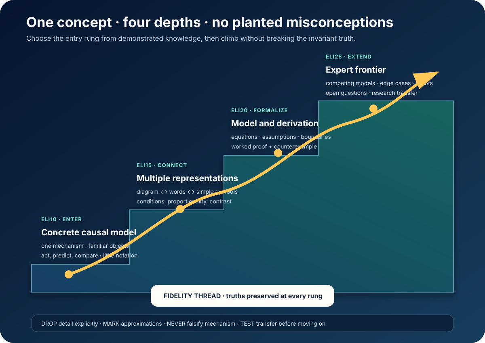

# One Concept at Four Depths

*A simpler explanation may reduce resolution. It may not reverse causality,
change the ontology, or plant something the learner must later unlearn.*

A universal expert mentor needs more than a personalized sequence of topics. It
needs to render the **same concept** at the depth a learner can productively act
on now—and preserve a path all the way to expert use.

Call the rungs ELI10, ELI15, ELI20, and ELI25. These are sophistication bands,
not ages. A child with deep experience may enter high. An adult beginner may
enter low. The system chooses a provisional entry from demonstrated prerequisite
knowledge and lets the learner move immediately.

## The four operational rungs

| Rung | Model | Representations | Learner action |
|---|---|---|---|
| ELI10 — enter | one concrete causal mechanism | object, story, sketch | predict, manipulate, compare |
| ELI15 — connect | invariant across contrasting cases | words ↔ diagram ↔ light symbols | translate, vary, reconstruct |
| ELI20 — formalize | general model with assumptions | notation, derivation, executable example | derive, prove, implement, diagnose |
| ELI25 — extend | competing models and frontier | proofs, papers, datasets, code | critique, generalize, design, research |

The rungs differ in prerequisite load, vocabulary, formalism, abstraction, and
edge-case coverage. They do not differ merely in sentence length.

## The fidelity thread

Every ladder begins with the most complete grounded model the system can build.
It then compiles lower-resolution views under a contract.

### Invariants

These truths survive every rung.

For natural selection:

- individuals in a population vary;
- some variation affects reproduction in an environment;
- heritable variants can change frequency across generations;
- populations evolve; individuals do not evolve because they need to.

### Declared omissions

The ELI10 version may omit drift, gene flow, population-genetic equations, and
frequency-dependent selection. The omission is visible, with a link forward.
Nothing omitted is replaced by a false universal.

### Marked approximations

“Treat the surface as frictionless” includes:

- when that approximation is useful;
- what it preserves;
- when it breaks;
- what the next rung adds.

### Forbidden implications

The generator actively tests whether the simple representation implies a named
misconception: that force is needed for constant velocity, that a heavier object
falls faster in a vacuum, or that an atom literally looks like a tiny solar
system.

## Why this is newly buildable

Current systems can close the loop between diagnosis, grounded generation,
validation, and post-test:

- [PathBuilder](https://aclanthology.org/2026.acl-demo.50/) reports a deployed
  curriculum-aligned pathway system with 75 matched learners, a 37.9-point mean
  gain, normalized gain 0.760, and Cohen’s d = 0.98. `MEASURED-BENCH`;
  nonrandomized.
- [TeachCraft](https://aclanthology.org/2026.acl-long.1328/) scaffolds source
  selection, objective sequencing, and schema-bound lesson synthesis, reaching a
  reported 67.8% human-evaluation win rate against eight baselines.
  `MEASURED-BENCH`
- In a randomized study of
  [971 programming students](https://arxiv.org/abs/2606.28882), diverse
  explanations produced about 7.7% higher open-ended accuracy than generic
  explanations without increasing perceived cognitive load. `MEASURED-RCT`
- [ELI-Why](https://aclanthology.org/2025.findings-acl.1306/) evaluates
  explanations against the learner’s information need, not a single reference
  answer. `MEASURED-BENCH`

The models supply breadth. The ladder supplies cumulative structure.

## Adapt entry; do not stereotype

Simple support can become redundant for an expert—the expertise-reversal effect.
So the mentor does not infer depth from age, grade, accent, device, or preference.

It asks for a compact reconstruction, prediction, or transfer:

- If the learner succeeds, move up.
- If evidence is uncertain, give a short contrast task.
- If a prerequisite is missing, enter at the first rung where meaningful action
  succeeds.

The learner can say:

- “show me the equation”;
- “give me the missing rung”;
- “use a physical example”;
- “what is this version hiding?”;
- “test whether I can skip ahead.”

Preference chooses among valid representations. Evidence chooses depth.

## Climbing is an act

The learner has not climbed because the mentor displayed harder prose.

A bridge asks them to:

1. reconstruct the current model;
2. translate it into another representation;
3. predict a new case;
4. name the approximation and break condition;
5. explain what the next rung adds without discarding the invariant.

This turns explanation from consumption into model building.

## How the ladder compiles

1. Ground the full formal explanation in sources, code, or derivation.
2. Extract invariant claims and prerequisite dependencies.
3. Name common misconceptions.
4. Generate each rung as a controlled projection.
5. Declare omissions and approximation boundaries.
6. Test forbidden implications adversarially.
7. Build one action per rung and one bridge per transition.
8. render local-language, speech, sign, tactile, visual, print, and offline forms
   from the same contract.
9. Use transfer evidence to revise both learner entry and the ladder itself.

Analogy is handled the same way. Every source-to-target mapping states which
relation transfers and where the analogy breaks.

## Universal access

A concept ladder is compact infrastructure:

- a community server can cache all four text/vector rungs;
- familiar examples can localize without changing invariant science;
- local expertise can be recognized instead of erased by grade assumptions;
- a teacher can inspect what each level omits;
- one contract can become speech, sign, tactile instructions, diagrams, physical
  activities, or formal notation;
- high-cost media is generated only when it enables a learning action.

The result is not “easy content for poor devices.” It is the same route to the
expert frontier, with an entry and medium that work where the learner is.

## The standard

> **One concept, multiple resolutions, one fidelity thread.**

The learner should never pay conceptual debt for being a beginner. Every rung
must be useful now, truthful at its resolution, and visibly connected to the
expert model it becomes.

**Research basis:** [F10 frontier research and source index](../research/raw/F10-explanation-depth-laddering-2026.md)
