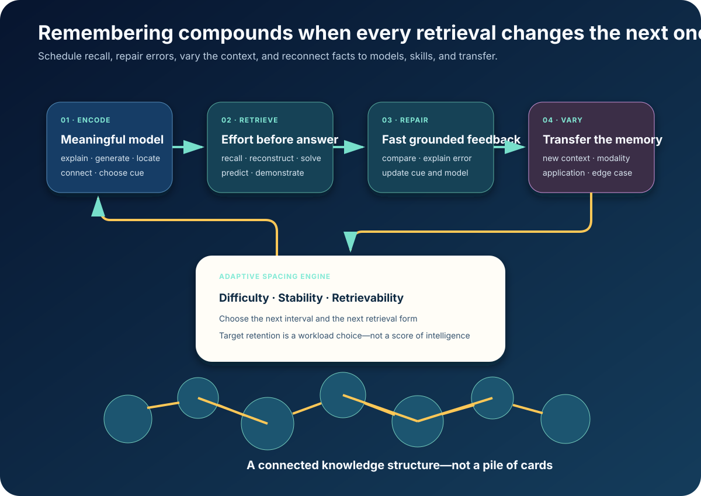

# The Memory That Compounds



*A scheduler chooses when. An expert mentor also chooses what, how, and why to
remember.*

Understanding is not retention.

A learner can have the perfect explanation, experience real insight, solve the
problem—and be unable to reconstruct the idea a month later. If the universal
mentor ends when the explanation lands, it has completed only half the work.

Scientific remembering is a second loop:

> **Select → encode → retrieve → repair → vary → space → integrate.**

It is not a deck of trivia and not an engagement streak. It is a long-running
service that keeps useful knowledge available with the least humane workload.

## The July 2026 scheduler

FSRS‑6 is the current open baseline.

Its [documented model](https://github.com/open-spaced-repetition/fsrs4anki/wiki/ABC-of-FSRS)
tracks three values for each memory:

- **Difficulty:** how hard it is to increase stability;
- **Stability:** how long retrievability takes to fall to 90%;
- **Retrievability:** estimated probability of recall now.

FSRS‑6 uses 21 fitted parameters, incorporates all reviews, learns from a
learner’s history when sufficient, and otherwise begins with defaults fitted on
several hundred million reviews from roughly 10,000 users. `OBSERVED`;
project-reported provenance.

The implementation is [open](https://github.com/open-spaced-repetition/fsrs4anki),
has a public [benchmark](https://github.com/open-spaced-repetition/srs-benchmark),
and is part of current [Anki](https://github.com/ankitects/anki/releases).

The learner chooses a desired retention target. Higher recall means more reviews.
That is a workload decision, not a measure of intelligence.

## Current evidence reaches beyond cards

Recent studies put retrieval into authentic work:

- Two 2025 RCTs behind
  [Counting Days](https://doi.org/10.1038/s41539-025-00322-5) rewarded practice
  across days rather than question volume. `MEASURED-RCT`
- Retrieval improved learning in
  [real primary-school settings](https://pubmed.ncbi.nlm.nih.gov/40861368/).
  `MEASURED-RCT`
- A 2026 stratified trial compared re-solving
  [virtual patients, MCQs, and short answers](https://pubmed.ncbi.nlm.nih.gov/41503782/)
  for medical-student retention. `MEASURED-RCT`
- Spaced histopathology cases improved diagnostic scores by a reported 1.9/10
  and reduced median case time by 1.4 minutes among 42 participants.
  [Study](https://pubmed.ncbi.nlm.nih.gov/42130248/) `MEASURED-RCT`
- 2025–26 reviews now synthesize the evidence specifically for
  [mathematics](https://aidanhorner.org/papers/Murrayetal_EdPsychReview_2025.pdf)
  and [medical education](https://pubmed.ncbi.nlm.nih.gov/41601436/).
  `MEASURED-BENCH`

The retrieval event can be a diagnosis, explanation, derivation, diagram,
physical procedure, code repair, prediction, or application. Flashcards are one
interface.

## The memory contract

The mentor stores more than a prompt and answer:

| Field | Example |
|---|---|
| Durable target | net force equals rate of change of momentum |
| Kind | relationship |
| Conditions | inertial reference frame |
| Connections | momentum, mass, acceleration, vectors |
| Retrieval forms | explain, draw, solve, diagnose, predict, transfer |
| Cue ladder | none → structure → first step → contrast → answer |
| Evidence | accuracy, latency, confidence, cue, error, context |
| State | difficulty, stability, retrievability |

Different memories require different retrieval:

- produce a word, not only recognize it;
- reconstruct a relationship, not only select its name;
- perform a procedure with fading support;
- classify perceptual examples and justify the features;
- generate examples and nonexamples of a concept;
- locate and evaluate an external source when memorization has low value.

Expertise includes knowing what *not* to memorize.

## The compounding loop

### Select

Decide whether a target should be fluent in biological memory, regenerable from a
model, practiced as a skill, indexed for external retrieval, or allowed to expire.

### Encode

Connect it to a causal explanation, prior knowledge, contrast, meaningful use,
and—when useful—a vivid spatial cue. A 2025
[method-of-loci meta-analysis](https://pubmed.ncbi.nlm.nih.gov/40457944/)
supports immediate and sustained recall benefits. Mnemonics help encode arbitrary
mappings; they do not replace reasoning. `MEASURED-BENCH`

### Retrieve

Attempt before seeing the answer. Capture partial correctness, latency,
confidence, cue level, error type, representation, and context.

### Repair

Give fast, grounded feedback. Explain the error and reconnect the answer to the
model so that the correction—not the mistake—is strengthened.

### Vary

Move through:

```text
recognize → produce → explain → apply → transfer → teach
```

Success should change the retrieval form, not merely lengthen the interval for
the same screen.

### Space

Use observed memory to schedule the least costly future retrieval consistent
with the target retention and deadline. Smooth workload and treat missed days as
new scheduling information, never moral failure.

### Integrate

Merge atomized memories into chunks. Replace memorized outputs with generative
rules. Retire obsolete details. Keep edge cases. Schedule a transfer or creation
task when ordinary recall saturates.

## Two coupled loops

Remembering and reasoning must remain distinct:

```text
retention: retrieve → repair → space
reasoning: model → vary → apply → transfer
```

Pure recall can become inert. Pure explanation can vanish. A strong mentor uses
retrieval to keep the inputs to reasoning fluent and uses reasoning to compress
facts into meaningful structure.

## AI makes the loop humane

A static deck cannot see the learner’s project, language, explanation, or error
history. The mentor can:

- derive memory targets from real goals;
- generate new retrieval forms without changing the claim;
- distinguish recalled, derived, guessed, and externally retrieved answers;
- give diminishing cues instead of revealing the answer too early;
- place a due concept inside today’s meaningful work;
- schedule locally and sync tiny event logs later;
- let the learner inspect, export, correct, merge, or delete memory obligations.

Current systems are already assembling the pieces.
[IntelliCode](https://aclanthology.org/2026.eacl-demo.10/) coordinates assessment,
learner profiling, hints, curriculum, spaced repetition, and engagement around a
shared state. [TASA](https://arxiv.org/abs/2511.15163) combines learner memory and
forgetting dynamics in mathematics tutoring. `OBSERVED` / `MEASURED-BENCH`

## Universal access

Remembering is unusually suitable for universal deployment:

- the scheduler and memory state run on-device;
- review objects are tiny and work offline;
- speech supports learners who cannot type or read fluently;
- local language and examples change the cue without changing the claim;
- shared devices can protect separate encrypted states;
- print packets can be reviewed and synced later through a teacher;
- five-minute sessions can fit real lives without turning a missed day into
  punishment.

The same open scheduler can serve a medical student, a village health worker, a
child building number fluency, an adult learning a trade, or a farmer learning a
new procedure. The content and stakes differ. The right to a memory that
compounds does not.

## The standard

> **Do not merely make knowledge land. Help the learner summon, use, connect, and
> keep it—at the moment life requires it.**

That is the difference between a remarkable tutoring session and a mentor whose
value grows across years.

**Research basis:** [F11 frontier research and source index](../research/raw/F11-scientific-remembering-2026.md)
