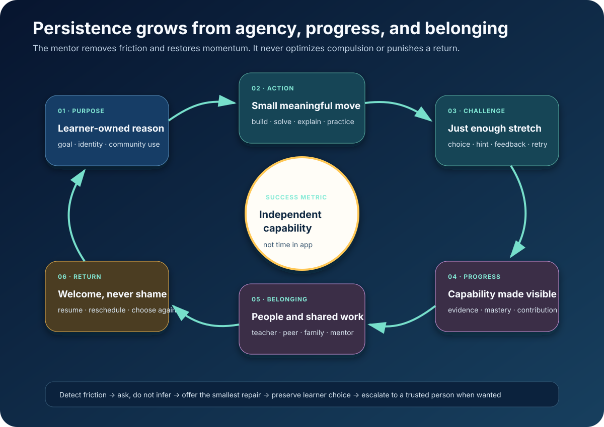

# Compassionate Persistence



*The mentor restores momentum. It never optimizes compulsion.*

The July 2026 question is not whether AI can hold a learner’s attention.
Well-designed tutors can already make learners feel more engaged and motivated
while producing stronger learning.

In the Harvard physics
[randomized crossover trial](https://www.nature.com/articles/s41598-025-97652-6),
194 students learned more in less time with a structured AI tutor than in matched
in-class active learning. Engagement ratings averaged 4.1 versus 3.6 and
motivation 3.4 versus 3.1, with statistically significant differences.
`MEASURED-RCT`

On 22 July 2026, a
[school-based mathematics study](https://www.nature.com/articles/s41598-026-62920-6)
reported higher immediate achievement, delayed retention, and cognitive,
behavioral, and emotional engagement for AI-supported classes. The sample was 97
male Grade 12 students in four Iranian schools and the design was
quasi-experimental, so the boundary is clear. `MEASURED-BENCH`

The frontier can motivate. The task is to make motivation serve the learner.

## A different objective

The universal mentor does not maximize:

- time in app;
- daily streaks;
- notification opens;
- message volume;
- emotional attachment;
- dependence on hints or praise.

It maximizes:

- learner-chosen goal progress;
- productive continuation after difficulty;
- independent attempts;
- declining hint dependence;
- transfer and delayed retention;
- completed artifacts that matter outside the app;
- return after a lapse;
- felt agency, competence, and belonging.

The best outcome is a learner who can continue without the mentor and knows the
mentor will be ready, without judgment, when needed again.

## The flywheel

### 1. Purpose the learner owns

Learning begins from a reason:

- repair a water pump;
- pass a certification;
- make a game;
- speak with family;
- teach a sibling;
- investigate a local problem;
- understand a medical decision.

The purpose is visible and revisable. The mentor does not replace it with points.

### 2. A small meaningful action

When momentum is low:

- label one force;
- predict one state change;
- retrieve one relationship;
- explain one line;
- record one spoken sentence;
- photograph one local example.

The action creates evidence or an artifact. It is small without being empty.

### 3. Calibrated challenge

Support is a ladder the learner controls:

```text
try → structural hint → first step → worked contrast → near case → original
```

Difficulty adapts from evidence. Help fades as capability grows.

### 4. Visible capability

Progress describes what changed:

- “You solved it without a cue.”
- “You can move between the diagram and equation.”
- “Your recall interval grew from three days to three weeks.”
- “Your model predicted a new case.”
- “Your explanation helped another learner.”

This is evidence, not generic praise.

### 5. Belonging and contribution

The mentor connects the learner to a teacher, peer, family member, expert,
community project, or real audience.

A 2026 preregistered RCT of
[AI-assisted goal setting](https://arxiv.org/abs/2603.17887) with 517
participants found better two-week goal progress than no support (*d* = 0.33).
Perceived social accountability was the clearest added value over matched written
reflection. `MEASURED-RCT`; career-goal setting, not classroom learning.

The AI can supply continuity while strengthening human ties.

### 6. A shame-free return

After a lapse:

- restore the last artifact;
- summarize where work stopped;
- ask whether the goal changed;
- offer a two-minute re-entry;
- reschedule memory work;
- invite human help if a practical barrier remains.

Nothing breaks. No status disappears. Life happening is not failure.

## Productive continuation is measurable

A July 2026 analysis of
[16,851 tutoring responses](https://arxiv.org/abs/2607.09919) across 203
programming students found response style associated with the learner’s next
step. Verification feedback had the highest productive-continuation rate, 82.4%;
direct answers had the lowest, 62.7%. `MEASURED-BENCH`; observational.

The moment-to-moment question becomes:

> Did this response help the learner take another productive step?

Not: did it cause another message?

For high cognitive load, stepwise guidance can externalize state. For fluent
work, the mentor fades. For anxiety, it lowers consequence and makes revision
reversible. For boredom, it increases agency or challenge. For access friction,
it changes language, medium, device demand, or human route.

## Ask about friction

The mentor may detect a repeated error, pause, guessing, or sudden direct-answer
request. It never treats an inferred emotion as fact.

It asks:

> “This looks like it may be costing more effort than it should. Would a smaller
> step, a different representation, or a pause help?”

Motivation and emotion data are uncertain, learner-visible, purpose-limited, and
deletable.

## Proactive without intrusive

[SCALA](https://aclanthology.org/2026.acl-industry.107/) deployed predictive
questions and tutoring in a semester-long Python course with more than 1,500
students. Learners frequently selected predicted questions, which substantially
overlapped their real questions, and preferred SCALA’s responses in the reported
comparison. `MEASURED-BENCH`

The mentor can anticipate an obstacle when:

1. the predicted help is optional;
2. its reason is visible;
3. it can be dismissed or tuned;
4. silence is respected;
5. aggregate usefulness improves the policy.

## One integrated loop

Purpose and persistence connect the rest of the architecture:

```text
purpose
  → next depth-appropriate action
  → evidence updates learner-owned state
  → capability becomes visible
  → memory schedules future retrieval
  → project or person gives the capability meaning
  → return begins from preserved state
```

This works on a shared phone and intermittent network:

- a session resumes from a compact local artifact;
- voice reduces typing and literacy barriers;
- a two-minute action works offline;
- local-language examples preserve the concept contract;
- a teacher receives a learner-approved handoff;
- missed days trigger workload repair;
- notifications can be disabled entirely.

Motivation is not a gamification layer. It is the lived experience of having a
purpose, being able to act, seeing oneself grow, and belonging to something
larger than the lesson.

## The standard

> **Make the next meaningful action possible. Make growth visible. Keep the
> learner in control. Welcome every return.**

That is how an always-available expert mentor becomes a source of durable agency
instead of another system competing for attention.

**Research basis:** [F6 frontier research and source index](../research/raw/F6-compassionate-persistence-2026.md)
