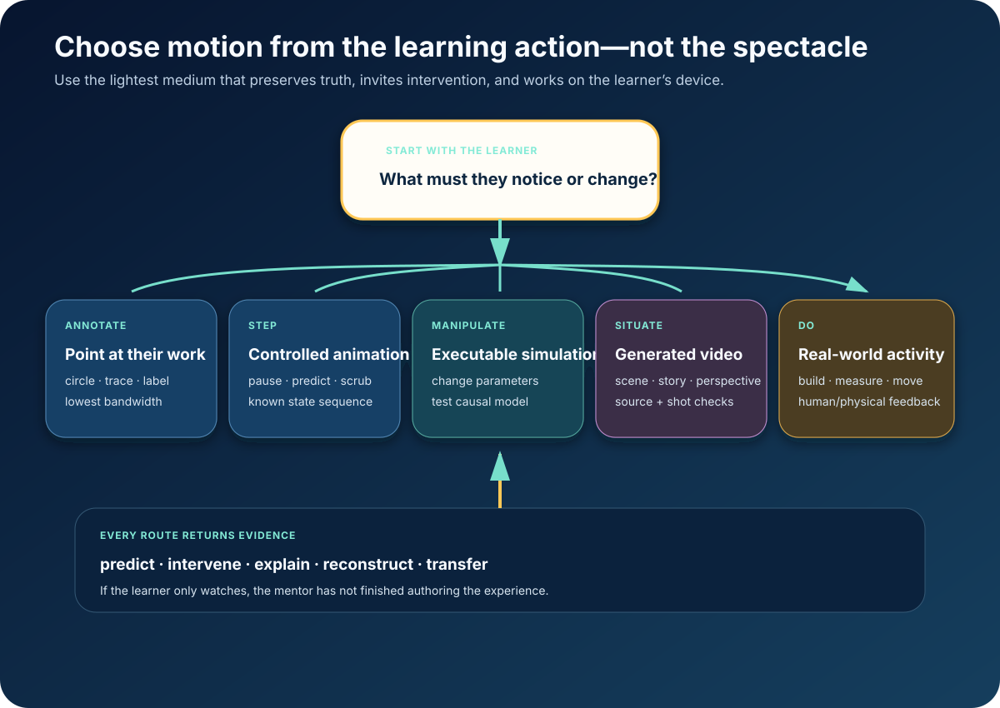

# From Motion to Intervention



*Choose motion from the learning action—not the spectacle.*

By July 2026, video generation has become a multimodal editing surface.

Google’s current [developer guide](https://ai.google.dev/gemini-api/docs/video)
recommends Gemini Omni Flash for video generation and conversational editing from
text, images, audio, and video. [Veo 3.1](https://ai.google.dev/gemini-api/docs/veo)
offers eight-second video with native audio at 720p, 1080p, or 4K plus frame
control and extension. [Sora 2](https://openai.com/index/sora-2/) generates video
and audio and is exposed through an API production surface. `VENDOR`

At the same time, programmatic animation systems can generate scene code, render
it, inspect the frames, and repair only the broken region.
[OmniManim](https://arxiv.org/html/2605.15585v1) formalizes that loop around a
shared scene state, visual plan, post-render diagnostics, and localized repair.
`MEASURED-BENCH`

The result is not a future of infinitely generated lectures. It is a mentor that
chooses the right visual instrument at the moment of confusion.

## Five routes

### Annotate

Circle the sign error. Trace one connection. Overlay one vector. Label the
learner’s own photograph.

Annotation is fastest, cheapest, and most personal. It preserves the learner’s
authorship.

### Step

Use a controlled animation when order or hidden state is the concept:

- an algorithm trace;
- a grammar transformation;
- a derivation;
- cell division;
- machine assembly.

The learner pauses, scrubs, steps, hides layers, predicts the next state, and
compares traces.

### Manipulate

Use an executable simulation when intervention is the lesson:

- change force and predict motion;
- vary population parameters;
- rewire a circuit;
- change a probability distribution;
- shift chemical conditions.

State transitions come from code, equations, data, or a validated simulator—not
plausible pixels.

### Situate

Generate video when place, viewpoint, culture, affect, or analogy is essential:

- show a procedure in the learner’s environment;
- compare camera perspectives;
- dramatize a historical choice;
- visualize a scale humans cannot directly see;
- rehearse a social interaction.

The video carries a source-grounded shot contract: required events, forbidden
implications, continuity, narration claims, camera purpose, and learner pause
points.

### Do

Send the learner into the physical or social world when the target is embodied:

- build;
- measure;
- role-play;
- interview;
- observe;
- repair;
- practice with an expert.

The AI prepares, supports, reflects, and hands off. Reality remains the medium.

## The asset is incomplete without an action

Every generated experience includes:

1. a prediction before reveal;
2. learner-controlled pacing;
3. an intervention or reconstruction;
4. a contrast or counterfactual;
5. a transfer task;
6. an accessible equivalent;
7. a low-bandwidth derivative;
8. evidence returned to learner-owned state.

For an algorithm animation:

```text
predict the next move
  → advance one state
  → drag the selected element
  → explain the invariant
  → diagnose a different algorithm
```

If the learner only watches, authoring is unfinished.

## Truth travels outside the pixels

Each medium has an inspectable authority:

| Medium | Source of truth |
|---|---|
| annotation | original learner artifact + concept contract |
| animation | state machine, equations, code |
| simulation | executable model and invariants |
| generated video | shot contract and grounded narration |
| physical activity | verified procedure plus human/sensor observation |

[EduAIGV‑1k](https://arxiv.org/html/2603.03066v1) evaluates 1,130 early-math
videos from ten generation models against expert-curated prompts.
[DataReel](https://arxiv.org/abs/2604.25220) pairs structured data, charts, and
narration for 328 video stories and uses separate planning, generation, and
verification. `MEASURED-BENCH`

The pattern is consistent with the
[verified visual](11-verified-visual-generation.md): check semantics and render
independently.

## Universal delivery

The experience degrades gracefully:

```text
text state description
  → still keyframes
  → low-frame-rate vector animation
  → locally cached interactive code
  → compressed generated video
  → frontier multimodal regeneration
```

The prediction, intervention, and reconstruction survive every tier.

Labels and narration remain separate for translation. A motion-disabled learner
gets a static sequence. A blind learner gets ordered state changes and a physical
or tactile equivalent. Keyboard and switch controls cover pause, step, reset,
and parameter change. A teacher can print keyframes and run the same prediction
sequence without a network.

At current provider pricing, bespoke 4K video is not the universal default.
Annotation, vector animation, and executable code run locally or at a community
hub. Expensive video is routed to high-value scene-specific needs, then shared as
a verified, localizable learning object.

## The standard

> **Use the lightest medium that preserves the claim, invites the needed
> intervention, and works on the learner’s actual device.**

The frontier is not that every explanation can move. It is that every learner can
receive the exact motion, model, or real-world action that makes the next idea
theirs.

**Research basis:** [A2 frontier research and source index](../research/raw/A2-generative-interactive-explanations-2026.md)
