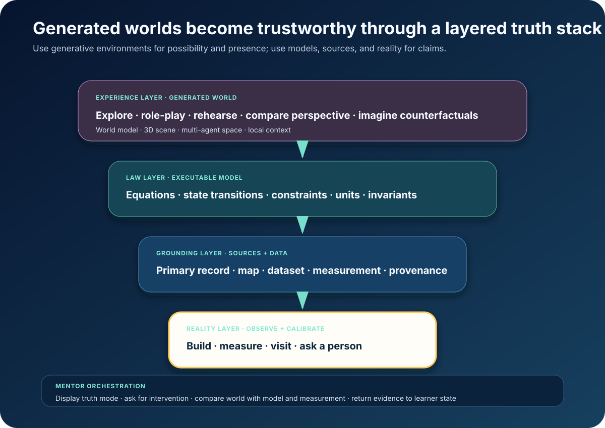

# Worlds You Can Question



*Use generated worlds for possibility and presence. Use models, sources, and
reality for claims.*

The interactive world crossed into the product layer.

- [Project Genie](https://blog.google/innovation-and-ai/models-and-research/google-deepmind/project-genie/)
  lets people create, explore, and remix generated worlds.
- Its May 2026
  [Street View grounding](https://blog.google/innovation-and-ai/models-and-research/google-deepmind/project-genie-expands/)
  ties starting places to real imagery.
- [Marble](https://www.worldlabs.ai/blog/marble-world-model) generates persistent
  3D worlds from text, images, video, panoramas, and layouts, then exports them
  through a public [World API](https://www.worldlabs.ai/blog/announcing-the-world-api).
- [Agora‑1](https://odyssey.ml/introducing-agora-1) lets multiple humans and AI
  agents share one real-time generated world.
- [SIMA 2](https://deepmind.google/blog/sima-2-an-agent-that-plays-reasons-and-learns-with-you-in-virtual-3d-worlds/)
  reasons, converses, acts, and improves across virtual environments, including
  generated Genie worlds.

These are provider-reported capabilities. The educational implication is an
inference: a world-class mentor can now create a new place to practice, compare,
role-play, and investigate for one learner.

The generated world does not have to be the scientific authority.

## The verified-world stack

### Experience

The world model supplies:

- presence;
- viewpoint;
- place and story;
- alternative scenarios;
- shared roles;
- rapid remixing;
- memorable context.

Badge: **GENERATED EXPERIENCE**.

### Law

Equations, state machines, constraints, simulation engines, data models, and
verified code determine exact consequences.

Badge: **MODELLED — assumptions available**.

The generator renders state. It does not invent the law.

### Grounding

Maps, primary records, datasets, scientific sources, sensor readings, local
testimony, and provenance anchor claims.

Badge: **GROUNDED — source available**.

### Reality

The learner builds, measures, visits, observes, interviews, and practices with a
person.

Badge: **OBSERVED — context recorded**.

The mentor keeps the mode visible. It can say, “This scene is an informed
counterfactual,” “This trajectory comes from the stated equations,” or “This
value came from your sensor.”

## What learners can now do

### Enter a counterfactual

Change one assumption and explore both worlds:

- high and low gravity;
- two ecological policies;
- alternative city layouts;
- different historical constraints.

The learner predicts which observations distinguish the worlds. The executable
model produces consequences; sources separate record from speculation.

### Exchange perspective

Enter the same system as engineer, resident, regulator, ecosystem, patient,
family, producer, or buyer. Reconstruct what each actor knows and compare with
the shared record.

### Rehearse decisions

Practice:

- laboratory protocol;
- equipment maintenance;
- emergency response;
- clinical interview;
- public speaking;
- conflict mediation.

A verified checklist and a person retain authority over safety-critical action.

### Learn with an agent society

Inside one world:

- a domain agent checks claims;
- a simulation agent governs dynamics;
- role agents present perspectives;
- an assessment agent observes decisions;
- an accessibility agent transforms navigation;
- a teacher enters or reviews the trace.

### Build the world

The learner writes the contract, chooses the law, predicts behavior, instruments
the environment, invites a peer or agent, compares the trace with data, and
revises.

Creation turns a world from scenery into an executable argument.

## Evidence that worlds can transfer

A 2026
[Interactive World Simulator](https://arxiv.org/abs/2603.08546) reports learned
visual interactions lasting more than ten minutes at 15 FPS on one RTX 4090.
Across the studied robotics tasks, policies trained with world-model-generated
data performed comparably to policies trained on the same quantity of real data,
and simulated performance correlated strongly with real performance.
`MEASURED-BENCH`

This does not certify every generated environment. It demonstrates a productive
pattern: world-model practice becomes valuable when a real evaluation loop
calibrates it.

[iWorld‑Bench](https://arxiv.org/abs/2605.03941) now evaluates visual generation,
trajectory following, and memory together. `MEASURED-BENCH`

## Universal worlds

The decision task travels across delivery tiers:

```text
verbal scenario
  → illustrated map
  → pre-rendered path
  → lightweight web 3D
  → community-server simulation
  → streamed generative world
  → immersive display
```

A community can supply panoramas, oral histories, maps, tools, materials,
procedures, language, and accessibility landmarks. One workstation generates and
caches the world. Phones receive a lightweight scene or rendered path. Printed
maps and role cards preserve the multi-perspective exercise without a GPU.

The architecture does not deliver “lesser worlds” to low-bandwidth learners. It
preserves the hypothesis, decision, social roles, and evidence loop at every tier.

## The standard

> **Every generated world declares its truth mode. Every exploration contains a
> decision. Every model exposes its assumptions. Every important claim can return
> to source, measurement, or reality.**

World models make imagination explorable. The verified-world stack makes that
imagination a serious learning substrate.

**Research basis:** [A5 frontier research and source index](../research/raw/A5-verified-generative-worlds-2026.md)
