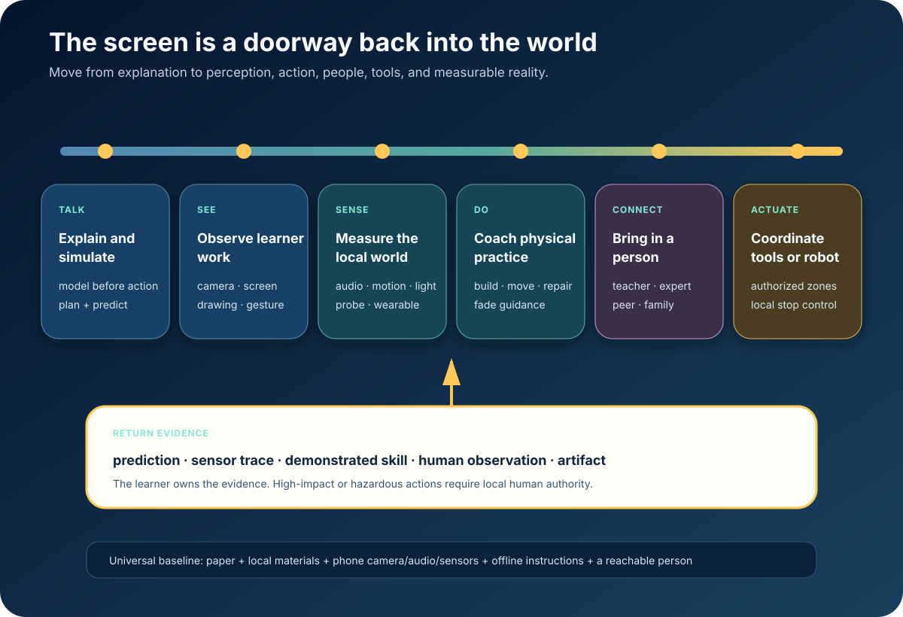

# The Screen Is a Doorway



*The phone is a sensor and coach—not the destination.*

The universal mentor should not pull every act of learning into a screen. It
should turn the device outward:

- see the learner’s work;
- measure the local environment;
- coach a physical attempt;
- connect a person;
- compare a model with reality;
- preserve evidence of demonstrated capability.

Robotics is the far end of this continuum. The universal baseline is simpler and
already powerful: paper, local materials, a phone camera and microphone, basic
sensors, offline instructions, local-language voice, and a reachable human.

## The physical frontier is here

[Gemini Robotics‑ER 1.6](https://blog.google/innovation-and-ai/models-and-research/google-deepmind/gemini-robotics-er-1-6/)
exposes multi-view spatial understanding, planning, success detection, and
instrument reading through an API. `VENDOR`

[Gemini Robotics On-Device](https://deepmind.google/blog/gemini-robotics-on-device-brings-ai-to-local-robotic-devices/)
runs locally for low-latency, intermittent, or zero-connectivity physical
control. Google reports adapting tasks from 50–100 demonstrations. `VENDOR`

The [Gemini app](https://blog.google/innovation-and-ai/products/gemini-app/3d-models-charts/)
can generate interactive simulations and 3D models inside a conversation.
`VENDOR`

An expert mentor can therefore move through a complete loop:

```text
simulate → predict → perform → measure → compare → revise
```

## The continuum

### Talk

Explain the goal, test prerequisites, simulate alternatives, predict outcomes,
identify hazards, and agree on a stopping rule.

### See

Observe only what the learner chooses to share:

- notebook;
- circuit;
- plant;
- machine;
- movement;
- craft;
- meal;
- instrument;
- map.

Point, annotate, ask, and compare with a grounded procedure. Recording remains
off unless needed and chosen.

### Sense

Use the camera, microphone, motion sensors, timer, location when appropriate,
connected probes, wearables, or teacher observation. Measurements carry units,
calibration, timestamp, context, and uncertainty.

The sensor trace—not the model’s description—becomes evidence.

### Do

Coach physical practice:

1. retrieve or demonstrate the next step;
2. ask for a prediction;
3. watch the attempt;
4. give one correction;
5. fade overlays and cues;
6. ask for independent performance;
7. revisit later in a different context.

### Connect

Bring in a teacher, peer, family member, craft expert, coach, clinician, community
worker, or remote specialist when tacit judgment, culture, relationship,
certification, or safety matters.

The handoff carries the learner-approved goal, artifact, evidence, exact blocker,
and what the AI already tried.

### Actuate

If a tool or robot acts, permissions are narrow: allowlisted actions, mapped
exclusion zones, speed and force limits, pre/postcondition checks, local emergency
stop, human confirmation for consequential steps, and a complete event log.

The robot is a collaborator and instrument. It is never the authority over a
child.

## Embodied learning has current evidence

[REVERIE](https://www.nature.com/articles/s41591-025-03724-5) used adaptive
virtual coaches for table tennis and soccer in an eight-week RCT with 227
adolescents across physical, VR, and control groups. `MEASURED-RCT`

A 2026
[systematic review and meta-analysis](https://www.nature.com/articles/s41598-026-42962-6)
supports immersive AR/VR as an adjunct for motor competence when matched to the
target domain. `MEASURED-BENCH`

A mixed-methods study of
[1,182 university students](https://www.nature.com/articles/s41598-026-39778-9)
connects wearable dashboards and personalized feedback with physical-literacy
and engagement measures. `MEASURED-BENCH`; observational.

[AI Unplugged](https://arxiv.org/abs/2602.13242) teaches search, Markov decision
processes, Q-learning, and hidden Markov models through physical collaborative
games before moving into mathematics and code. `OBSERVED`

Embodiment does not require a headset or robot. Bodies and people are already the
most widely deployed learning hardware.

## What reality teaches

A screen cannot fully supply:

- force, balance, proprioception, timing, or fatigue;
- tool feel and material behavior;
- smell, temperature, texture, and sound in context;
- coordination with another person;
- consequences in an open environment;
- cultural and relational knowledge;
- tacit expert judgment;
- responsibility for a real outcome.

The mentor prepares attention, expands safe practice, and supports reflection.
Reality supplies the consequence.

## One contract, many embodiments

A physical learning contract specifies:

- goal;
- materials and environment;
- executable model;
- sensor scope;
- allowed actions;
- prohibited actions;
- stop conditions;
- local supervisor;
- evidence;
- reflection.

The same contract drives phone guidance, a printable checklist, simulation, AR
overlay, human handoff, robot permissions, assessment, and later retrieval.

For a solar-circuit task, the learner predicts a meter reading, chooses the
range, measures, and explains any discrepancy. Battery connection may require a
local supervisor. Unexpected voltage, damaged insulation, heat, or smell stops
the activity.

## Universal embodiment

### Every learner

Paper, pencil, local materials, phone sensors, voice, offline instructions, and a
reachable person.

### Community

Shared probes, microcontrollers, projector, tools, science/craft materials, local
server, printed procedures, and a trained facilitator.

### Regional

Remote experts, laboratory or fabrication access, certified simulations,
calibrated instruments, and robotics where justified.

Frontier reasoning reaches everyone. Scarce people and equipment are routed to
the moments that truly need them.

## The standard

> **Model before action. Observe during action. Reflect after action. Keep a
> local person in authority when consequence is physical.**

The endpoint of an embodied mentor is not a more immersive screen. It is a learner
who can perceive, decide, build, repair, coordinate, and act independently in the
world.

**Research basis:** [F7 frontier research and source index](../research/raw/F7-embodied-mentor-2026.md)
