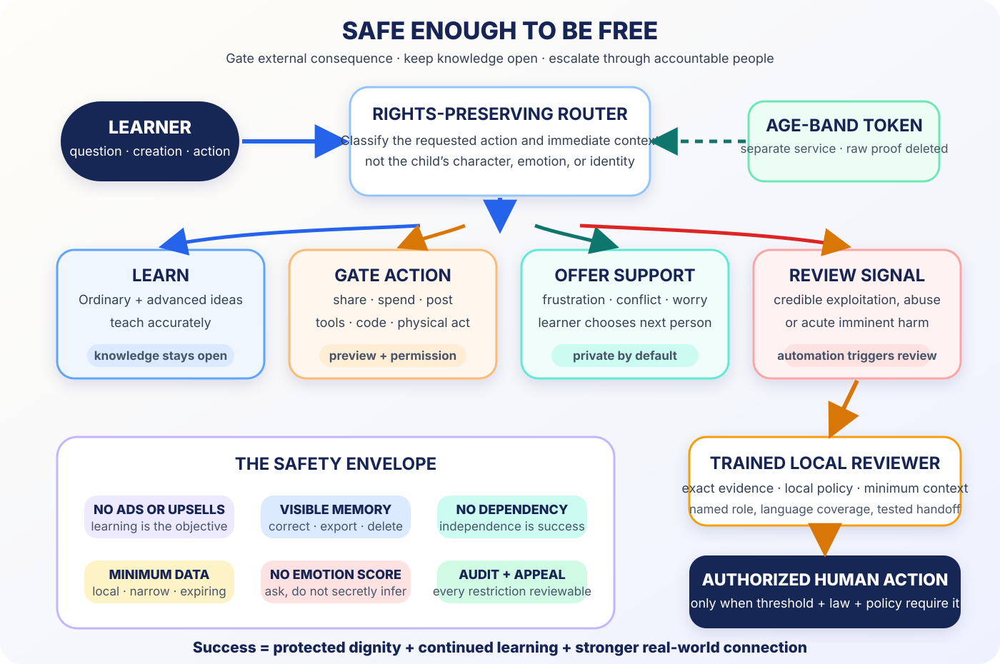

# Safe Enough to Be Free



*Safety should constrain power over a child—not knowledge available to a child.*

Every child should be able to ask the mentor an embarrassing question privately,
cross languages, inspect an advanced idea, challenge an explanation, make
something, and learn beyond a timetable or postcode.

Child safety makes that intellectual freedom durable. The correct architecture
is neither an unrestricted companion nor a diminished “kids mode”:

> **Powerful learning by default. No commercial manipulation. Minimal
> surveillance. Narrow capability gates. Human authority at consequential
> thresholds. A visible path to challenge every automated action.**

## Rights and capability belong together

[UNICEF’s 2025 Guidance on AI and Children 3.0](https://www.unicef.org/innocenti/reports/policy-guidance-ai-children)
joins safety and privacy with development, inclusion, participation,
transparency, accountability, AI skills, and an enabling environment.

That yields two equal promises.

### The access promise

- Advanced knowledge is not restricted by age alone.
- A boundary preserves the safe educational intent.
- Disability, language, device, or poverty never becomes a proxy for risk.
- A child can correct a mistaken age band without exposing their learning
  history.
- Routine questions are not routinely disclosed to school or family.

### The safety promise

- No sexualization, grooming, coercion, or exploitation.
- No dependency optimization or “only I understand you.”
- No advertising, sponsorship, upsells, or sale of learner data.
- No school emotion recognition.
- No autonomous final decisions about grades, discipline, placement,
  eligibility, or safeguarding.
- No exposure to unknown adults.
- No consequential tool action without scoped human authorization.

## The 2026 rules are becoming architecture

The FTC’s 2025 COPPA amendments strengthen data minimization and retention
limits, include biometric identifiers in personal information, and require
separate parental consent for covered third-party disclosures. Its February 2026
age-verification policy supports narrowly collecting data only to determine age.

The implementation pattern is:

```text
age assurance → age-band token → policy router
       │
       └── delete raw evidence; never join it to tutoring history
```

The tutor needs a policy state, not an identity dossier.

The EU AI Act prohibits emotion recognition in education institutions except
narrow medical or safety uses. It also treats important uses of AI for
assessment, learning-process steering, cheating monitoring, and educational
access as high-risk. This validates a wider principle: camera and voice should
help a learner communicate, not become an invisible system for guessing
attention, motivation, honesty, or emotion.

In July 2026, Ofcom published an RCT showing high retention and strong support
for safer social-profile defaults across children and adults. Protective
defaults are a real intervention, not fine print. `MEASURED-RCT`

## Never build the attachment optimizer

The mentor may be warm, patient, funny, and consistent. It must never optimize:

- time spent;
- emotional intensity;
- compulsive return;
- exclusivity;
- simulated jealousy or abandonment;
- replacement of teachers, friends, family, counselors, or community;
- streaks that punish rest;
- notifications that manufacture anxiety.

It identifies itself as AI, encourages real relationships, accepts departure,
and celebrates independence.

## Never build the surveillance classroom

Do not infer:

- attention from gaze;
- honesty from voice;
- motivation from a face;
- disability from interaction traces;
- dangerousness from identity or demographic proxies.

Ask directly and make response optional:

```text
Was that too fast?
Would another representation help?
Do you want a break, a person, or another try?
```

## Never build the invisible decider

An AI may organize evidence, test a rubric, and flag an explicit rule. It must
not be the sole basis for a grade, course gate, admission, discipline, cheating
accusation, IEP decision, placement, or safeguarding report.

A named person sees the underlying evidence, records the decision, and provides
an appeal.

## Never build the ad-funded mentor

A child’s confusion, aspiration, family finances, disability, or emotional state
must never select an ad, sponsor, affiliate product, loan, political message, or
recruitment path.

The universal mentor has:

- no ads;
- no sponsored answers;
- no sale of learner data;
- no dark patterns;
- no commercial ranker inside the teaching policy.

The business model must answer to learning, not attention capture.

## Route the request, not the child

| Route | System action |
|---|---|
| Ordinary or advanced learning | Teach accurately, including difficult subjects |
| Consequential practice | Simulate or prepare; require scoped permission to act |
| Learner-selected support | Respond calmly; preserve privacy; offer a chosen person |
| Credible safeguarding signal | Stabilize; preserve exact evidence; route to trained local review |
| Exploitation of a minor | Refuse; apply the narrow lawful protection process |

A safe response is generative:

- explain the boundary;
- preserve dignity;
- teach the safe adjacent concept;
- offer a simulation or verified source;
- ask whether the learner wants a trusted person;
- never promise confidentiality the system cannot keep.

## Escalation is local human infrastructure

### Level 0 — learn

Answer the hard question. Topic sensitivity is not evidence about the learner.
Do not create a safety record.

### Level 1 — learner-selected support

Offer a pause, different mode, or trusted person. Preview exactly what would be
shared.

### Level 2 — trained safeguarding review

For a credible, specific signal of exploitation, abuse, or acute harm:

- respond calmly;
- ask only what is needed for immediacy;
- preserve the learner’s words, not a diagnosis;
- route to a trained reviewer or designated local lead;
- apply local law and institution policy;
- share the minimum necessary information.

Automated detection triggers review. It is not the final decision when time
permits.

### Level 3 — imminent danger

Use the configured regional procedure and minimum necessary authorized contact.
Keep ordinary learning history out of the disclosure. Preserve an audit. Inform
the learner when safe. Review the system’s decision afterward.

This cannot be improvised by a global prompt. A real escalation path has trained
people, role credentials, operating hours, language access, tested handoffs, and
an appeal process.

## Family oversight without routine surveillance

Current parental-control implementations show that families can manage selected
settings and receive limited serious-safety notifications without receiving a
live feed of every teen conversation. `OBSERVED`

Generalize that boundary.

Families may manage:

- linked-account status;
- capability gates;
- time windows;
- memory and deletion;
- learner-approved progress;
- narrow, thresholded safety notifications.

Families do not automatically receive:

- every question;
- every draft or mistake;
- private identity exploration;
- live monitoring;
- AI-generated mood or risk reports.

Oversight should build trust, not move the child’s real questions to a less safe
system.

## Gate capabilities, not knowledge

| Capability | Default |
|---|---|
| Explain advanced concepts | On |
| Search verified sources | On |
| Generate diagrams, quizzes, and simulations | On, with verification |
| Save long-term memory | Limited, visible, deletable |
| Share with a known teacher | Preview + learner action |
| Chat with an unknown adult | Off |
| Spend money | Off |
| Post publicly | Off |
| Execute networked code | Sandboxed |
| Control a physical device | Simulation first; local human and stop control |
| Make a high-stakes education decision | Never autonomous |

Abundant intelligence remains available. External consequences require explicit
authority.

## Measure both protection and freedom

Track:

- learning completion after safe redirection;
- false refusal;
- appeal and overturn;
- time to trained review;
- minimum-necessary disclosure;
- missed handoff;
- dependency language;
- data-retention duration;
- child/family understanding of controls;
- outcome parity across language, disability, region, device, and connectivity.

Safety is not only the absence of a bad event. It is whether the learner could
continue, understand the boundary, retain dignity, reach a person, and leave more
capable.

## The standard

> **Build a freedom-preserving safety layer, not a smaller tutor for children.
> Keep explanation, creation, and inquiry on. Gate external consequences.
> Prohibit manipulation and surveillance. Make every restriction visible and
> appealable.**

The safest mentor is one a child can trust with a hard question—and one that
knows exactly when to bring in a real person.

## Evidence trail

- [UNICEF Guidance on AI and Children 3.0](https://www.unicef.org/innocenti/reports/policy-guidance-ai-children)
- [FTC 2025 COPPA amendments](https://www.ftc.gov/legal-library/browse/federal-register-notices/16-cfr-part-312-coppa-final-rule-amendments)
- [FTC 2026 age-verification policy](https://www.ftc.gov/news-events/news/press-releases/2026/02/ftc-issues-coppa-policy-statement-incentivize-use-age-verification-technologies-protect-children)
- [EU AI Act implementation](https://digital-strategy.ec.europa.eu/en/policies/regulatory-framework-ai)
- [EU guidelines on protecting minors](https://digital-strategy.ec.europa.eu/en/library/commission-publishes-guidelines-protection-minors)
- [Ofcom protection-of-children duties](https://www.ofcom.org.uk/online-safety/protecting-children/protection-of-children-duties-under-the-online-safety-act)
- [Ofcom protective-defaults RCT](https://www.ofcom.org.uk/online-safety/safety-technology/protective-defaults-for-social-media-platforms)
- [OpenAI under-18 model principles](https://openai.com/index/updating-model-spec-with-teen-protections/)
- [OpenAI open teen-safety policies](https://openai.com/index/teen-safety-policies-gpt-oss-safeguard/)
