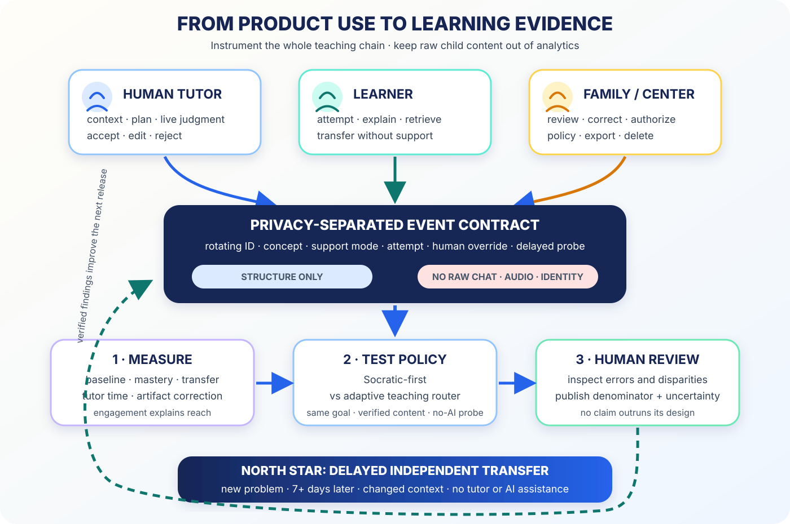

# From Product Use to Learning Evidence



*A deployed product becomes research when use, teaching policy, and independent
learning are connected.*

LessonOrca’s public July 2026 product is broader than a chatbot. It gives tutoring
centers continuity:

- the next tutor sees prior evidence and the current focus;
- AI drafts lesson plans, notes, homework, and parent communication;
- learners receive between-session support;
- families and tutors review AI interactions;
- organizations control guidelines.

On 19 April 2026, LessonOrca reported live use across three Bay Area centers, 25
tutors, and 100 students. `VENDOR`

That proves deployment, not learning impact. No authorized PostHog export,
preregistered analysis, or de-identified outcome dataset is present in this
repository. So the next step is not a promotional case study. It is a
measurement program.

## The best current analogy is human-plus-AI tutoring

[Tutor CoPilot](https://arxiv.org/abs/2410.03017) tested AI-generated expert
guidance in live K–12 tutoring. Its preregistered trial found a four-percentage-
point improvement in topic mastery overall and a nine-point improvement for
students of lower-rated tutors. `MEASURED-RCT`

The 2025 [LearnLM/Eedi trial](https://arxiv.org/abs/2512.23633) had expert tutors
supervise AI-drafted messages. Tutors approved 76.4% with zero or minimal edits;
AI-supported learners were 5.5 percentage points more likely to solve novel
subsequent problems than the human-tutor-only group. `MEASURED-RCT`

This supports LessonOrca’s strongest current architecture: AI carries context and
drafts high-quality moves; the human tutor keeps relationship, judgment, and
authority.

## Socratic is a mode, not the whole policy

LessonOrca publicly describes its between-session tutor as “Socratic method
only.” `VENDOR`

Current 2026 work shows why that should be a controlled baseline:

- a curriculum-graph tutor separates **what to teach next**, **how to conduct
  Socratic dialogue**, and **what the learner knows**;
- PEARL trains Socratic behavior across multiple pedagogical rewards;
- K–12 programming and dynamic formative-assessment studies show useful
  contexts for questioning and explanation.

Socratic dialogue fits when the learner has enough prerequisite knowledge to
reason and the target is explanation, justification, or reflection.

The router should select:

| Learner state and goal | Teaching move |
|---|---|
| Missing prerequisite or overloaded working memory | Explicit instruction + worked example |
| Partial knowledge and useful misconception | Socratic question or hint |
| Known material due for strengthening | Retrieval |
| Fact request or time-sensitive correction | Direct answer + explanation + teach-back |
| High-confidence learner testing a claim | Verification or adversarial challenge |

That is still guided learning. It simply gives the mentor more than one tool.

## The outcome is independent transfer

The north-star metric is not turns, minutes, or return rate:

```text
correct solution to a new problem
at least 7 days after instruction
without tutor or AI assistance
using the target concept in a changed context
```

Engagement matters because a learner needs enough quality practice to benefit.
It remains a mediator.

A June 2026 pair of elementary RCTs found that adding human engagement support
increased AI-platform engagement by 71–80%, but usage remained low and reading
outcomes did not improve. The implication is straightforward: measure access,
use, teaching quality, and learning separately.

## The event contract protects the child

PostHog should receive pseudonymous, enumerated learning events—not raw child
content.

```yaml
allowed:
  - rotating actor ID
  - pseudonymous center ID
  - broad age and grade band
  - subject and concept ID
  - support mode and hint level
  - correctness and error taxonomy
  - delayed transfer score
forbidden:
  - name, email, phone
  - raw prompt or response
  - audio or transcript
  - disability label
  - parent message
```

Free text stays in the authorized education-record system. Analytics only sees
the minimum structure needed to answer a product question.

## Record the learning chain

1. `learning_goal_started` establishes the denominator and baseline.
2. `support_mode_selected` records Socratic, worked, retrieval, verification, or
   direct-with-teach-back.
3. `attempt_submitted` records item/version, support level, correctness, and
   error type.
4. `teaching_move_delivered` records method, grounding tier, and human edit.
5. `human_override_recorded` records accept, edit, reject, and reason.
6. `independent_probe_completed` records delayed no-AI transfer.
7. `profile_hypothesis_updated` links any learner-state change to evidence.
8. `privacy_action_completed` proves export, deletion, or revoked consent works.

No event is meaningful without a stable definition and denominator.

## Test the teaching router

After a clean observational baseline, randomize eligible concept units within
learner and subject:

### Socratic-first

Questions and hints under the current policy.

### Adaptive router

Explicit/worked instruction for prerequisite gaps; Socratic prompts for partial
knowledge; retrieval for known material; direct answer plus teach-back for a
fact or urgent correction.

Both groups receive the same:

- learning goal;
- verified content;
- access accommodations;
- practice opportunity;
- human escalation;
- delayed no-AI transfer probe.

Primary outcome: delayed independent transfer.  
Secondary: mastery efficiency, hint dependence, frustration, and next-session
retrieval.

This is not Socratic versus “giving away answers.” It compares two valid
teaching policies.

## Test tutor continuity separately

Compare basic context with an AI-generated, evidence-linked pre-session brief and
candidate plan. Measure:

- preparation minutes;
- plan accept/edit/reject;
- grade-level appropriateness;
- teaching-move quality;
- mastery and transfer;
- effect by tutor experience;
- parent-summary accuracy.

The expected gain may be largest where expert support was previously scarcest.
That is exactly the “no child left behind” mechanism: frontier expertise improves
the tutor already serving the child.

## Update the privacy contract before research

LessonOrca’s public privacy policy is dated 3 January 2025 and therefore predates
the FTC’s final 2025 COPPA amendments. It already states strong commitments:
education-only use, no advertising or sale, parent rights, role-based access,
encryption, and deletion after closure.

The 2026 version should additionally:

- name analytics processors and regions;
- ban raw text, audio, transcript, and identity from analytics properties;
- specify active-account retention by purpose;
- clarify whether “improving algorithms” includes any training;
- address voice and biometric data;
- separate any consent required for third-party disclosure;
- make export and deletion directly testable.

Measurement should strengthen the trust contract, not silently widen collection.

## What LessonOrca can claim after each stage

| Stage | Valid claim |
|---|---|
| Public deployment | “Used by these centers/tutors/students on this date” |
| Clean instrumentation | “We can reproduce use and outcome denominators” |
| Prospective baseline | “These outcomes co-occur under the current policy” |
| Randomized mode test | “This teaching policy caused a difference in this population” |
| Multi-center replication | “The effect travels across centers and tutors” |
| Longitudinal follow-up | “The learning persists and transfers” |

## The standard

> **Optimize delayed independent transfer. Use product analytics to explain the
> path, not replace the outcome. Keep raw child content out of analytics. Let
> every AI artifact be corrected by a person.**

LessonOrca can become unusually valuable evidence because it connects AI, the
human tutor, the family, and the next session. The scientific opportunity is to
make that chain measurable.

## Evidence trail

- [LessonOrca public product](https://lessonorca.com/)
- [LessonOrca April 2026 deployment snapshot](https://lessonorca.com/blog/skydeck-pad-13-canopy)
- [LessonOrca privacy policy](https://lessonorca.com/privacy)
- [Tutor CoPilot RCT](https://arxiv.org/abs/2410.03017)
- [LearnLM/Eedi RCT](https://arxiv.org/abs/2512.23633)
- [Structuring Socratic dialogue](https://arxiv.org/abs/2606.11744)
- [PEARL](https://arxiv.org/abs/2605.29582)
- [Access Is Not Enough](https://doi.org/10.26300/pz7p-p388)
