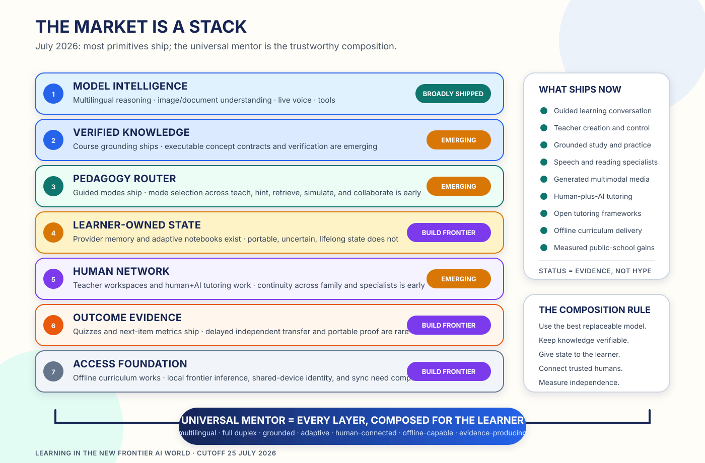

# The Market Is a Stack



*The frontier has moved from “can a model tutor?” to “who will compose the full
learning system?”*

The July 2026 market is easy to misread. A catalogue of startups makes it look
fragmented. A list of foundation models makes it look commoditized. Both views
miss the architecture.

The market already ships most of the primitives needed for a world-class mentor:

- guided conversation across almost any subject;
- source-grounded diagnosis, lessons, and quizzes;
- teacher-authored learning activities and differentiation;
- adaptive curriculum tutoring;
- real-time language and reading practice;
- multimodal diagrams, whiteboards, audio, video, and simulations;
- human-plus-AI tutoring continuity;
- open and self-hostable tutor frameworks;
- offline curriculum delivery;
- standards for portable learning credentials.

The missing product is the composition.

## The base model is no longer the tutor

[ChatGPT Study Mode](https://help.openai.com/en/articles/11780217-study-mode),
[Gemini Guided Learning](https://blog.google/products-and-platforms/products/education/guided-learning/),
and [Claude Learning mode](https://www.anthropic.com/news/introducing-claude-for-education)
all guide reasoning rather than merely produce a final answer. They ask
questions, layer explanations, work with uploaded materials, and check
understanding. `OBSERVED` / `VENDOR`

In June 2026, Gemini
[study notebooks](https://blog.google/products-and-platforms/products/education/iste-students-2026/)
went further: diagnose a learner’s gaps, construct bite-sized lessons, update the
plan from quiz results, and synchronize with NotebookLM. `VENDOR`

General learning conversation is therefore becoming infrastructure. The
defensible mentor is the system around the model:

```text
verified knowledge + learner state + teaching policy
+ real practice + trusted humans + outcome evidence
```

## Teachers now have a control surface for abundance

The teacher-facing market has rapidly expanded from text generation to a full
workflow.

[Claude for Teachers](https://www.anthropic.com/news/claude-for-teachers),
released on 14 July 2026, connects teaching skills, state standards, curriculum
resources, differentiation, and classroom-ready materials.
[ChatGPT for Teachers](https://openai.com/index/chatgpt-for-teachers/) provides a
protected K–12 workspace. [Gemini in Classroom](https://blog.google/products-and-platforms/products/education/collection-iste-june-2026/)
can use actual class context and is adding teacher-assigned adaptive study
notebooks and understanding summaries. `VENDOR`

School-native platforms add orchestration:

- [MagicSchool](https://www.magicschool.ai/faq) reports 80+ teacher tools, 50+
  student tools, 24 interface languages, translation into 98 languages, student
  rooms, assessment, and LMS connections. `VENDOR`
- [Brisk](https://help.briskteaching.com/hc/en-us/articles/38789659161364-What-is-Brisk-Teaching)
  works inside existing curriculum and teacher tools, then publishes
  teacher-controlled student experiences. `VENDOR`
- [Flint](https://flintk12.com/teachers) lets educators assemble spoken,
  written, visual, simulated, and assessment activities. `VENDOR`

The next design step is not another teacher content generator. It is one shared
system in which the learner, teacher, family, tutor, and AI see appropriate
views of the same goals, evidence, and next actions.

## Tutoring now has four complementary forms

| Architecture | Current strength | Examples |
|---|---|---|
| General learning assistant | Breadth, languages, files, low marginal cost | ChatGPT, Gemini, Claude |
| Curriculum-grounded tutor | Known sequence, practice, prerequisites | Khanmigo, Flint, Squirrel AI |
| Human-plus-AI system | Relationship, judgment, continuity | Tutor CoPilot, Eedi, LessonOrca |
| Open agent framework | Composability, self-hosting, research velocity | DeepTutor, Open TutorAI |

The winning universal architecture should combine all four.

[Khan Academy’s 2026 tutor work](https://blog.khanacademy.org/how-khan-academy-is-building-a-better-ai-tutor-our-most-recent-learnings/)
uses mastery and prerequisite state and reports a six-percentage-point product
improvement in next-item learning across its October 2025–April 2026 tests.
`VENDOR`

[Tutor CoPilot](https://arxiv.org/abs/2410.03017) improved K–12 topic mastery by
four percentage points overall and nine points for learners working with
lower-rated tutors. The
[LearnLM/Eedi trial](https://arxiv.org/abs/2512.23633) found expert reviewers
approved 76.4% of AI-drafted messages with zero or minimal edits and that the
AI-supported group was 5.5 percentage points more likely to solve novel
subsequent problems. `MEASURED-RCT`

[DeepTutor](https://arxiv.org/abs/2604.26962) now demonstrates an open agentic
direction: citation grounding, multi-resolution learner memory, calibrated
question generation, collaborative work, proactive skills, and multichannel
delivery. [Open TutorAI](https://opentutorai.com/) adds a self-hosted classroom
surface, source-grounded support, learner/teacher/parent roles, and avatar voice
and video. `RESEARCH`

These are not competing visions. They are layers waiting to be composed.

## Specialist perception remains essential

A general model that can speak is not automatically an early-reading teacher.
Child speech recognition, pronunciation, phonics progression, response latency,
and disability-aware support need specialized perception and pedagogy.

[Ello](https://www.ello.com/about) describes a child-specific speech stack and a
hierarchical teaching agent that listens while a child reads a real book.
[Amira](https://amiralearning.com/) listens, assesses, and tutors oral reading in
English and Spanish. [Google Read Along](https://support.google.com/readalong/answer/12279465)
provides real-time reading feedback. `VENDOR`

For language learning, [Duolingo Video Call](https://blog.duolingo.com/video-call/)
offers spontaneous level-adjusted conversation, while Flint provides
school-authored spoken practice. `VENDOR`

The universal mentor should preserve one relationship while routing perception
and feedback to the best specialist.

## Assessment is becoming the next lesson

Gemini study notebooks turn diagnostics into an adaptive plan. Google has
launched or announced no-cost full-length practice for the SAT, JEE Main, NEET,
ACT, GRE, and Brazil’s ENEM. MagicSchool provides quizzes and class-writing
feedback. Khanmigo measures whether a learner answers the next item correctly
after tutoring. `VENDOR`

The market still needs to move one step further:

```text
supported success
  → new problem
  → later date
  → changed context
  → no AI or tutor
  → portable evidence of transfer
```

[Open Badges and Comprehensive Learner Records](https://www.1edtech.org/sites/default/files/media/docs/2025/Wellspring_Phase_I_Report.pdf)
provide an interoperability base. The universal mentor should fill that
container with verified evidence the learner owns—not activity counts a vendor
controls.

## The global evidence is already stronger than the old market story

The most important 2026 market signal is not a funding round. It is measured
learning in public-school contexts.

In Sierra Leone, Google and Fab AI ran an eight-week preregistered RCT across 48
classrooms and nearly 1,800 Grade 7–8 learners. Guided Learning increased scores
on externally validated math assessments by 0.26 standard deviations. Google
compares this with roughly 1.2–1.7 years of typical progress in low- and
middle-income countries. [`MEASURED-RCT`](https://blog.google/products-and-platforms/products/education/measuring-the-impact-of-ai-on-teaching-and-learning/)

In Edo State, Nigeria, a six-week teacher-guided program using
Copilot/GPT-4 produced an effect of roughly 0.31 standard deviations and
transferred into regular curriculum subjects. The World Bank compares the gain
with 1.5–2 years of typical progress in similar settings.
[`MEASURED-RCT`](https://documents.worldbank.org/en/publication/documents-reports/documentdetail/099548105192529324)

This changes the burden of proof. The question is no longer whether frontier
tutoring can matter outside wealthy schools. The engineering question is how to
make a measured, teacher-guided system reliable on shared devices, intermittent
networks, local languages, and locally governed data.

## Offline is a compositional problem

[Kolibri](https://learningequality.org/kolibri/about-kolibri/) already provides
open, offline-first curriculum distribution and progress tracking on low-cost
and legacy hardware. Frontier tutoring usually still assumes the cloud.
`OBSERVED`

The practical bridge is a three-tier mentor:

1. a compact on-device layer for voice, retrieval, learner state, and common
   teaching moves;
2. a school or community hub for local content, stronger inference, and sync;
3. intermittent regional or cloud specialists for hard problems and updates.

This architecture can reach learners before universal broadband and can keep
more child data under local control.

## Build where the stack is still thin

By July 2026, fluent explanation, file understanding, generic Socratic dialogue,
quiz generation, translation, and basic voice are increasingly replaceable
components.

The durable build frontier is:

- a portable, uncertain, learner-owned model that compounds for years;
- a router that chooses the right teaching action, not one fixed method;
- executable concepts that generate consistent explanations, diagrams,
  simulations, practice, and assessment;
- full-duplex observation of speech, handwriting, tools, and real activity;
- a human mesh linking family, peers, teachers, tutors, and specialists;
- local-first intelligence with opportunistic synchronization;
- delayed independent transfer as the product’s north-star outcome;
- freedom to learn combined with strict limits on power over the child.

The 2026 market does not invalidate the universal-mentor thesis. It makes it
buildable.

The pieces exist. The next breakthrough is to compose them into a mentor that
belongs to the learner and can travel anywhere.
