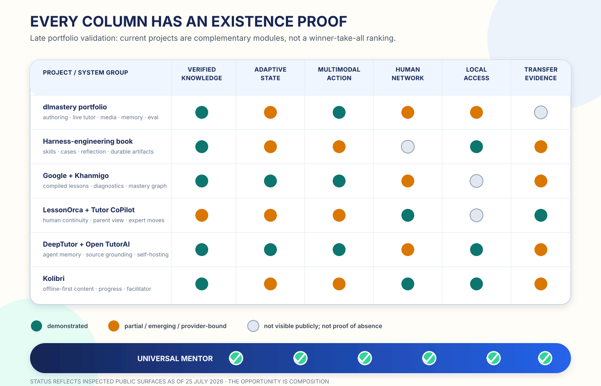

# The Union Is the Product



*Every column has been demonstrated. No current row contains the whole mentor.*

The universal-mentor standard was deliberately developed before inspecting the
author’s portfolio or comparable projects. Now that the standard is explicit,
the quarantine can end.

The result is encouraging: the specification survives contact with real
software. More importantly, much of the required system has already been built—
just not as one product.

## One portfolio already contains most of the ingredients

The detailed
[`dlmastery` portfolio audit](../research/raw/D2-portfolio-case-studies.md)
examined approximately 60 repositories, 35+ active projects, nine deployed
applications, 128 notebooks, production bundles, prompts, schemas, live audio
paths, media pipelines, and autonomous research systems. `INSPECTED`

Across those projects, the portfolio demonstrates:

- a mechanized zero-to-hero authoring method with validation and coverage audit;
- schema-constrained curriculum generation;
- live voice tutoring with interruption, transcripts, tool calls, and language
  switching;
- visual and video generation and progressive media delivery;
- cross-session memory in a non-learning application;
- compact checkpoints and append-only experiment ledgers;
- hard evaluation gates and autonomous champion promotion;
- a rural-first, offline-oriented product specification.

The missing step is not another prototype. It is the wiring:

```text
verified zero-to-hero content
  + live multimodal mentor
  + cross-session memory
  + experiment and evidence ledger
  + local-first delivery
  = one learning system
```

The portfolio’s apparent gaps—learner state, delayed assessment, runtime
verification, and offline execution—are integration seams between assets that
already exist.

## A current AI-native book adds the missing learning artifact

The April 2026 open book
[`Harnessing LLM Skills to Master Machine Learning`](https://github.com/xiaol/Harnessing-LLM-Skills-to-Master-Machine-Learning)
treats learning as harness engineering. Each chapter couples concepts and cases
with reusable skills, evaluation loops, memory, reflection, and evidence.
`INSPECTED`

Its [reader workflow](https://github.com/xiaol/Harnessing-LLM-Skills-to-Master-Machine-Learning/blob/main/src/how-to-use-reader-skills.md)
asks a learner to form a judgment, work a case, invoke a skill, compare the
result with their own reasoning, and save:

- what they accepted;
- what they rejected or revised;
- the next experiment.

This is a major design primitive. A chapter should not leave only notes in the
learner’s head. It should leave a reusable capability and an evidence artifact.

The AI-native textbook can therefore compile, for every concept:

```text
explanation + executable example + practice + assessment
+ reusable learner skill + evidence artifact + memory update
```

## Current systems each prove a layer

The point of comparison is not to crown one winner. It is to identify
demonstrated modules.

| System | Distinct proof |
|---|---|
| `dlmastery` portfolio | Authoring, verification, live tutoring, media, memory, and experiment machinery can be built |
| Harness-engineering book | Learning can leave reusable skills and inspectable judgment artifacts |
| Google Learn Your Way / study notebooks | Static material can become adaptive representations, diagnostics, lessons, and quizzes |
| Khanmigo | Dialogue can use curriculum mastery and prerequisite state |
| LessonOrca / Tutor CoPilot | AI can make human tutoring more continuous and distribute expert moves |
| Flint | Teachers can author multimodal, interactive learner activities |
| DeepTutor | Grounding, memory, questioning, research, and proactive skills can share an agentic substrate |
| Open TutorAI | A tutor can be open, self-hosted, classroom-based, and shared across learner, teacher, and parent roles |
| Kolibri | Learning can be local-first on low-cost and legacy devices |

[Google Learn Your Way](https://blog.google/products-and-platforms/products/education/learn-your-way/)
reported an 11-percentage-point advantage on a long-term recall test over a
standard digital reader. Gemini study notebooks now diagnose gaps, create
lessons, and update plans from results. `VENDOR`

[Khanmigo](https://blog.khanacademy.org/learning-in-the-open-what-ai-is-and-isnt-changing/)
uses mastery, prerequisites, and whether a learner is first encountering or
reviewing a skill. `VENDOR`

[Tutor CoPilot](https://arxiv.org/abs/2410.03017) produced four percentage points
of overall mastery gain and nine points for learners working with lower-rated
tutors. [`MEASURED-RCT`](https://arxiv.org/abs/2410.03017)

[DeepTutor](https://arxiv.org/abs/2604.26962) brings source grounding,
multi-resolution memory, calibrated question generation, collaborative work,
deep research, and proactive multichannel skills into one research framework.
`RESEARCH`

[Open TutorAI](https://opentutorai.com/) makes a source-grounded tutor
self-hostable and gives learners, teachers, and parents explicit roles.
`RESEARCH`

[Kolibri](https://learningequality.org/kolibri/about-kolibri/) supplies the
offline-first content and synchronization substrate. `OBSERVED`

No row is complete. Every required column has at least one working example.

## The shared contracts are the product boundary

The first coherent universal-mentor release does not need to merge every
codebase. It needs six stable contracts.

| Contract | What it makes interchangeable |
|---|---|
| `ConceptSpec` | Sources, prerequisites, invariants, misconceptions, examples, visuals, simulations, and practice |
| `LearnerState` | Goals, mastery uncertainty, evidence, memory strength, language, accessibility, and permissions |
| `TeachingAction` | Explain, model, hint, question, retrieve, simulate, collaborate, or escalate |
| `LearningEvidence` | Attempt, context, support, evaluator, confidence, next probe, delayed transfer, and credential |
| `MentorTool` | Model, retrieval, diagram, simulation, voice, state, scheduling, and human handoff |
| `SyncEnvelope` | Encrypted learner-controlled deltas across device, community hub, and cloud |

With those boundaries:

- a better model can replace the current model;
- a local curriculum authority can replace a global content source;
- a child-speech specialist can replace generic speech recognition;
- a school can self-host state while calling a cloud expert intermittently;
- evidence can follow the learner when a vendor does not.

That modularity is how a universal system becomes locally appropriate.

## The next release is a composition milestone

The practical sequence is short:

1. extract a shared mentor core instead of forking another tutor;
2. instrument delayed, independent, changed-context transfer;
3. connect the existing memory and ledger patterns to learner-owned state;
4. bring notebook verification gates into runtime lessons and visuals;
5. expose the active teaching action and its reason;
6. connect teacher, family, peer, tutor, and specialist views;
7. run core state, retrieval, voice, and common teaching moves locally.

This comparison changes the interpretation of the entire project.

The frontier is not blocked on an unknown invention. The components have
independent existence proofs. The work now is to compose them faithfully around
one learner—and let that learner carry the resulting intelligence and evidence
for life.
