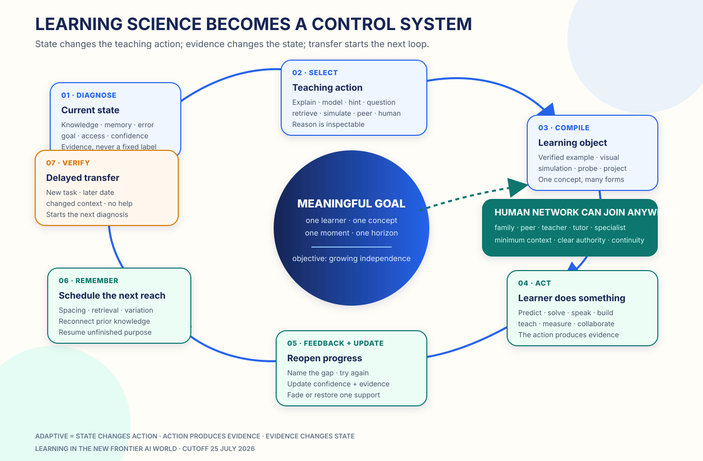

# Learning Science Becomes a Control System



*Frontier AI does not repeal learning science. It makes the strongest principles
executable for one learner, one concept, and one moment.*

The old learning-science section read like a library of average effects. That
evidence still matters, and its
[109-source archive](../research/raw/B1-learning-science.md) remains available.
But the July 2026 question is different:

> How should a mentor use learning science continuously, while it teaches?

The answer is a control loop:

```text
meaningful goal
  → diagnose current state
  → choose a teaching action
  → require learner action
  → give useful feedback
  → update uncertain state
  → schedule retrieval and variation
  → test delayed transfer
  → connect a human when useful
```

This loop replaces a false choice among Socratic dialogue, direct instruction,
practice, projects, and discovery. Those are not competing identities for the
tutor. They are actions it can select and sequence.

## The science floor is compact

A world-class mentor needs eight durable invariants:

1. prior knowledge changes which support is useful;
2. retrieval plus corrective feedback strengthens memory;
3. spacing determines what survives;
4. feedback should identify the gap and reopen action;
5. self-explanation and teaching reveal structure;
6. varied representations and contexts build transfer;
7. purpose, agency, progress, belonging, and shame-free return keep the loop
   alive;
8. collaboration adds explanation, coordination, critique, and joint creation.

The frontier contribution is to bind each principle to observable state and an
explicit teaching action.

## Current trials already look like loops

In Sierra Leone, an eight-week preregistered RCT across 48 classrooms and nearly
1,800 learners found Guided Learning improved externally validated math scores
by 0.26 standard deviations. Google compares the effect with roughly 1.2–1.7
years of typical progress in low- and middle-income countries.
[`MEASURED-RCT`](https://blog.google/products-and-platforms/products/education/measuring-the-impact-of-ai-on-teaching-and-learning/)

In Edo State, Nigeria, a teacher introduced each curriculum topic, learners
worked with a responsive AI tutor, and the program produced approximately 0.31
standard deviations of gain in six weeks, including transfer into regular
curriculum subjects.
[`MEASURED-RCT`](https://documents.worldbank.org/en/publication/documents-reports/documentdetail/099548105192529324)

A randomized 2026 study of 334 university learners found AI tutoring improved
exam performance by 0.23 standard deviations; unrestricted access outperformed
a forced-pre-reading policy by 0.21 standard deviations.
[`MEASURED-RCT`](https://papers.ssrn.com/sol3/papers.cfm?abstract_id=5992341)

These results argue against turning a plausible teaching sequence into doctrine.
A policy has to earn its place through learner outcomes.

## The state is about the next action

The mentor does not need to classify a child into a fixed “learning style.” It
needs uncertain, correctable signals:

| Signal | Consequence |
|---|---|
| Missing prerequisite | Step back and model it |
| Partial causal explanation | Target the missing link |
| Known but slow recall | Schedule retrieval |
| Repeated error pattern | Contrast near-neighbor cases |
| Success after one hint | Fade one support |
| Overload or interruption | Chunk, pause, and resume |
| Exam tomorrow vs durable mastery | Change depth and schedule |
| Language or disability access need | Change channel, not rigor |
| Peer or expert available | Route to social learning |

Every state claim carries evidence and confidence. Demographics never substitute
for observed knowledge.

## The action library is plural

### Explain directly

Use direct explanation when a prerequisite is missing, the learner asks for
orientation, or prolonged search only adds load.

A July 2026
[math-tutor field study](https://arxiv.org/abs/2607.01692) found that learners
under time pressure resisted rigid Socratic dialogue and used answer-first
checkpoints to diagnose their understanding. Layered worked examples,
step-linked visuals, and metacognitive scaffolds supported reasoning repair.
`OBSERVED`

Directness is compatible with active learning when the tutor immediately returns
the idea to the learner through prediction, reconstruction, explanation, or
application.

### Model and fade

A 2026 CHI experiment with 155 learners tested
[Buggy and Guided interactive worked examples](https://doi.org/10.1145/3772318.3791631).
Different formats worked differently by prior knowledge. `MEASURED-RCT`

The tutor should show a model, ask the learner to complete or debug it, and fade
only after independent evidence.

### Question and hint

Use Socratic questions when the learner has enough knowledge to reason and a
question can expose or repair a misconception. It is one excellent tool, not a
universal refusal to answer.

### Retrieve and vary

Recall, predict, reconstruct, and apply before revealing. Then revisit the idea
across time, representation, and context. The system stores delay, support
level, error pattern, and the next scheduled probe.

### Explain, build, and collaborate

Ask the learner to teach, critique, simulate, design, measure, debug, or work
with a peer. Learning is visible in action, not merely in message consumption.

## Support should be available and fade on evidence

[AI-ALOE](https://aialoe.org/wp-content/uploads/2026/03/AI-ALOE-Newsletter-Spring-26.pdf)
reported across 1,000+ adult learners and 256 sections that on-demand scaffolding
increased adoption by 50% relative to full scaffolding and that learners solved
more problems more efficiently. `OBSERVED`

The operating rule is simple:

```text
support as much as needed
  → probe the next independent step
  → fade one support
  → restore immediately when evidence changes
```

There is no shame in restoring help. The goal is a longer reach, not a purity
test.

## Every action compiles a different learning object

| Action | Object created now |
|---|---|
| Explain | Layered explanation with a fidelity contract |
| Model | Worked example with visible decisions |
| Hint | Smallest cue that reopens progress |
| Retrieve | Fresh probe without answer leakage |
| Contrast | Matched example and counterexample |
| Simulate | Executable model with inspectable variables |
| Teach-back | Audience, purpose, and explanation rubric |
| Collaborate | Roles and a shared artifact |
| Transfer | New surface context with the same deep structure |

Every object comes from one verified concept specification, so switching
teaching mode does not switch the truth.

## Memory schedules pedagogy

Memory is not a transcript warehouse. It reconnects questions to old knowledge,
schedules retrieval, varies the next context, repairs recurring errors, resumes
goals, and fades obsolete supports.

[Planning-guided tutoring with assessment-driven memory](https://aclanthology.org/2026.acl-long.325/)
and [LongTutor](https://aclanthology.org/2026.acl-long.1371/) show the 2026
direction: assessment, planning, and long-horizon learner histories become one
personalization substrate. `RESEARCH` / `MEASURED-BENCH`

## Optimize the right hierarchy

The mentor should optimize:

1. delayed independent transfer;
2. time to reliable independent success;
3. breadth across contexts and representations;
4. retention at the learner’s chosen horizon;
5. agency and willingness to return;
6. equitable access and participation;
7. human time used where it matters most.

Turns, minutes, streaks, completion, and immediate correctness help explain the
process. They are not the definition of learning.

An adaptive system earns its name only when a change in state changes the
teaching action, the reason is inspectable, the learner can correct the state,
and the policy is measured against delayed transfer.

That is what frontier AI adds to learning science: not a new slogan, but a
living, testable, improvable teaching loop available to every learner.
